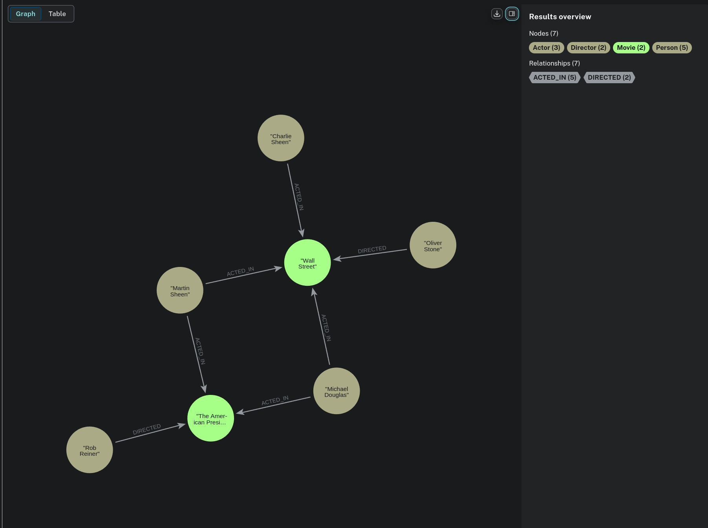
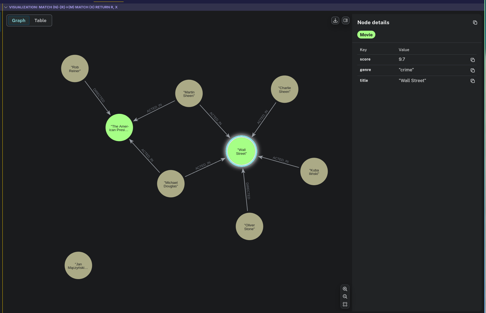
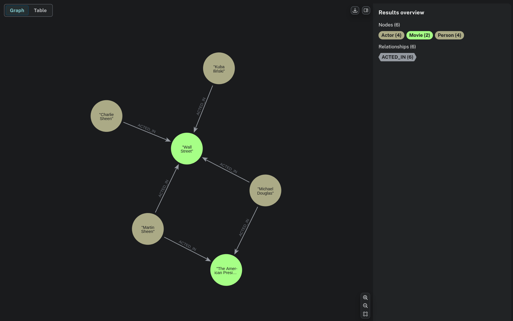
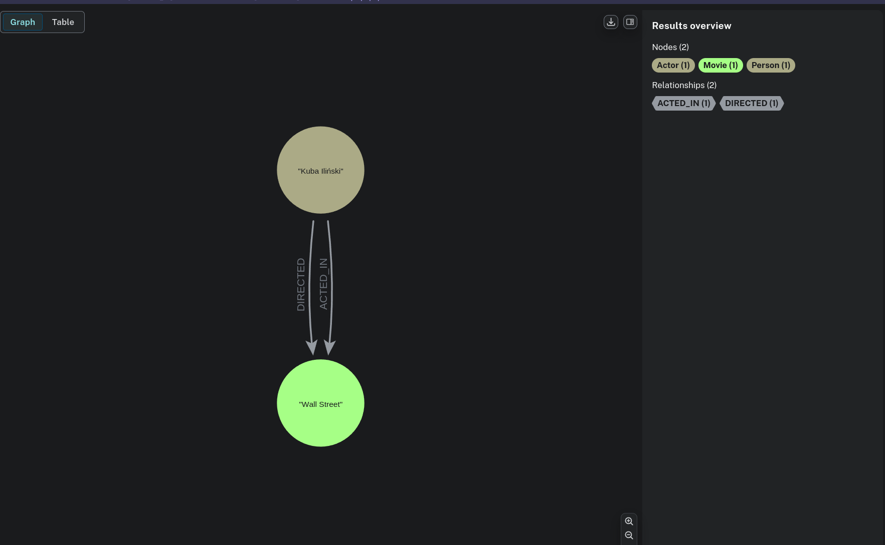
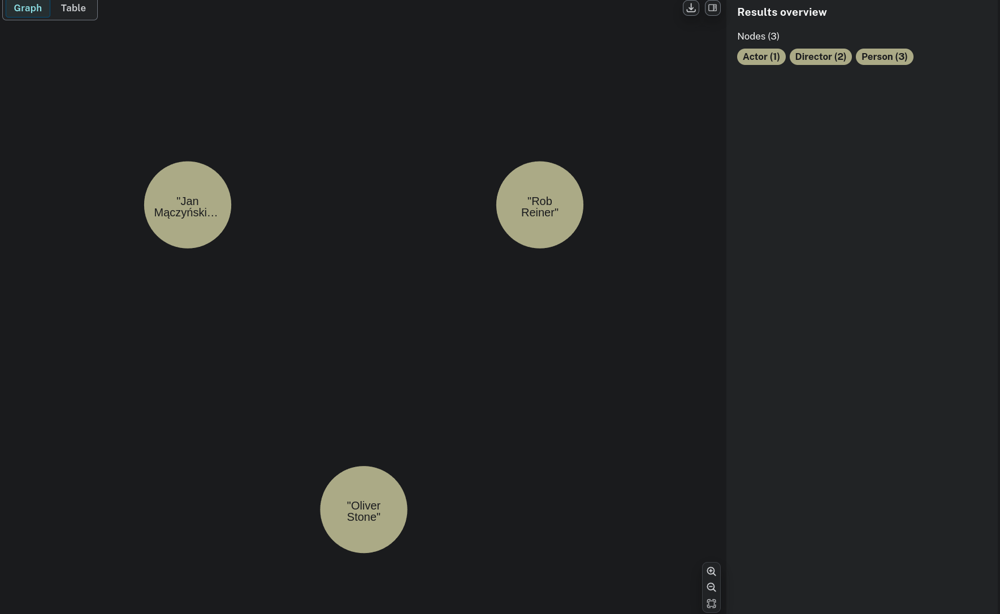
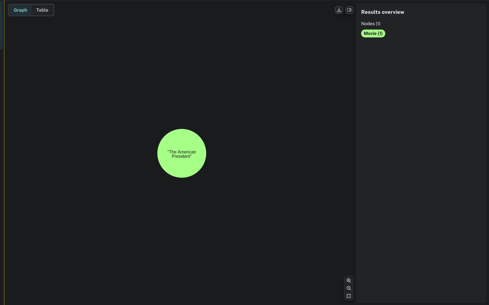
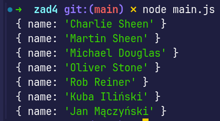
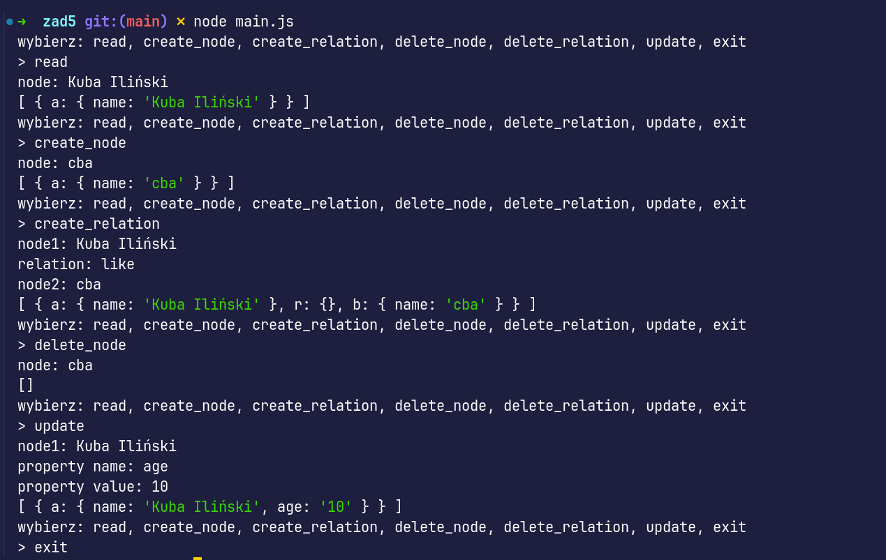

# Intro

Dzień dobry, zrobiłem zadania: `1`, `2`, `3`, `4`, `5`

---

# zad 1

Stworzyłem przykładową baze Movies:

---

# zad 2

Wynik na sam koniec:

widać że dostaliśmy:
* 2 nowych atorów
* film wall street ma 2 nowe własność genre i score 
* dodaliśmy 2 nowe relacje ('kuba iliński') -[:ACTED_IN]-> (m) // ale potem usuneliśmy że grał w jednym z filmów i nie widać połączenia
* zmieniliśmy własnośc ('wall street').score z 9.5 na 9.7

---

# zad 3

#### zwróć filmy w których gra osoba a

#### zwróć filmy gdize a była zarówno aktorei i reżyserem 

#### zwróć aktorów którzy nie grali w rzadnym filmie 

#### zwróć aktorów którzy graliw ponad 2 filmach 

#### zwróć filmy z największą liczbą aktorów

--- 

# zad 4

zadanie zrobiłem w js. w dokumentacji neo4j jest tutorial w którym pokazuja jak zrobić to co mamy zrobić w zadaniu : https://neo4j.com/docs/javascript-manual/current/

wynik odpaleia rozwiązania: 

--- 

# zad 5 

program rozbiłem na 3 pliki: 
* `main.js` który koordynuje prace, robi inity
* `handle_input.js` zajmuje sie obsługą inputu od użytkownika
* `crud.js` tutaj zajmuje się operacjami w bazie

przykładowe wykonanie
