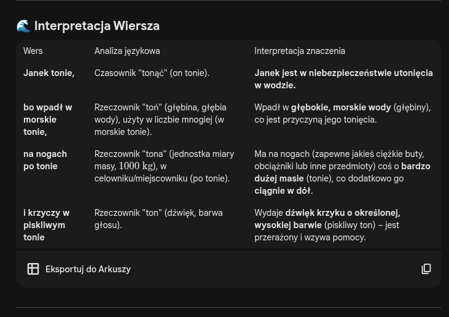

# zad1 

---- 

#### tonie:
* osoba w wodzie możę tonąć. `tonąć`
* tonie muzycznym `ton`
* tona jako 1000 kg `tona`
* toń jako głębina, odchłań `toń`

#### zdanie:

    janek tonie,
    bo wpadł w morskie tonie,
    na nogach po tonie
    i krzyczy w piskliwym tonie

