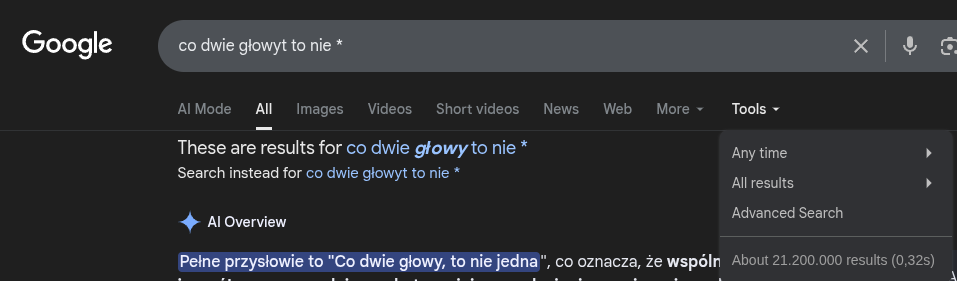
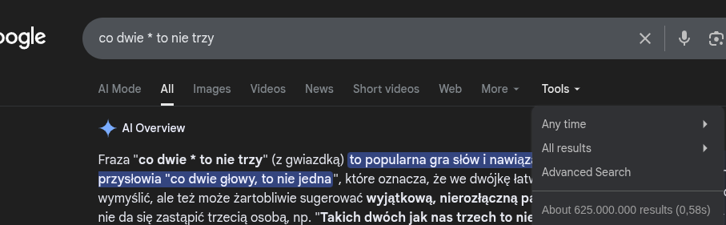

# zad 5 

--- 

#### wstępne obserwacje 
przyslowia często występują w konkretnej, niesmiennej formie
będziemy chceili osobno rozważyć różne typy zapytań
1. typ zaczynajace sie `co według przysłowia`, `z czym według przysłowia` ipt
2. który wyraz jest błędnie użyty 

---

### 1. typ

1. na początku heurystycznie (mocno ręcznie) musimy odfiltrować częś pytającą zdania (ale to nie problem bo to się pewnie mocno powtarza i widać patterny) znazwijmy otrzymaną cześć cp
2. robimy w google zapytanie: `* cp *`
3. scrapujemy top 10 rezultatów 
4. stemujemy otrzymany korpus i cp 
5. przechodzimy się po korpusie i jeśli napotkamy cp to spamiętujemy otaczające je kilka słów z lewej i kilka z prawej
6. ze spamietanych słów usuwamy stop wordy  // może trzeba to jeszcze przymyśleć 
7. zwracamny najczęściej powtarzające się słowo

### 2. typ 
w google możemy sprawdzić ilość rezultatów dla zapytania

splitujemy zdanie -> dostajemy liste słów 
[a, b, c, d]
robimy: 

    [
        [*, b, c, d]
        [a, *, c, d]
        [a, b, *, d]
        [a, b, c, *]
    ]

robimy takie zapytania w google i sprawdzamy które ma największy rezultat. zdanie z największym rezultatem to to w którym mamy niepoprawne słowo

