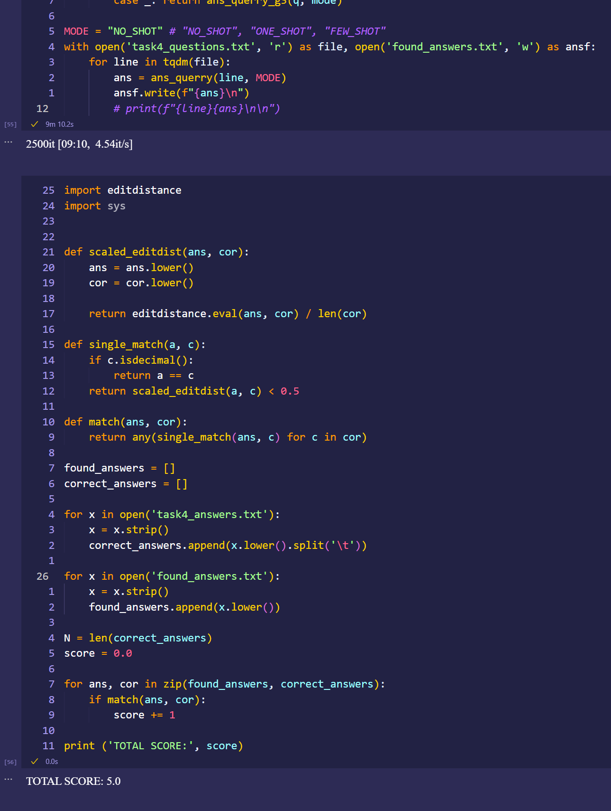
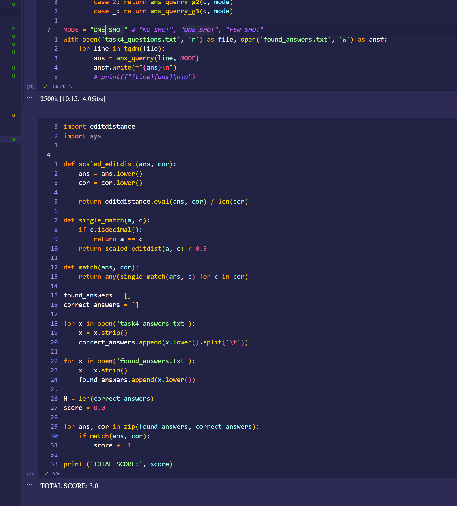
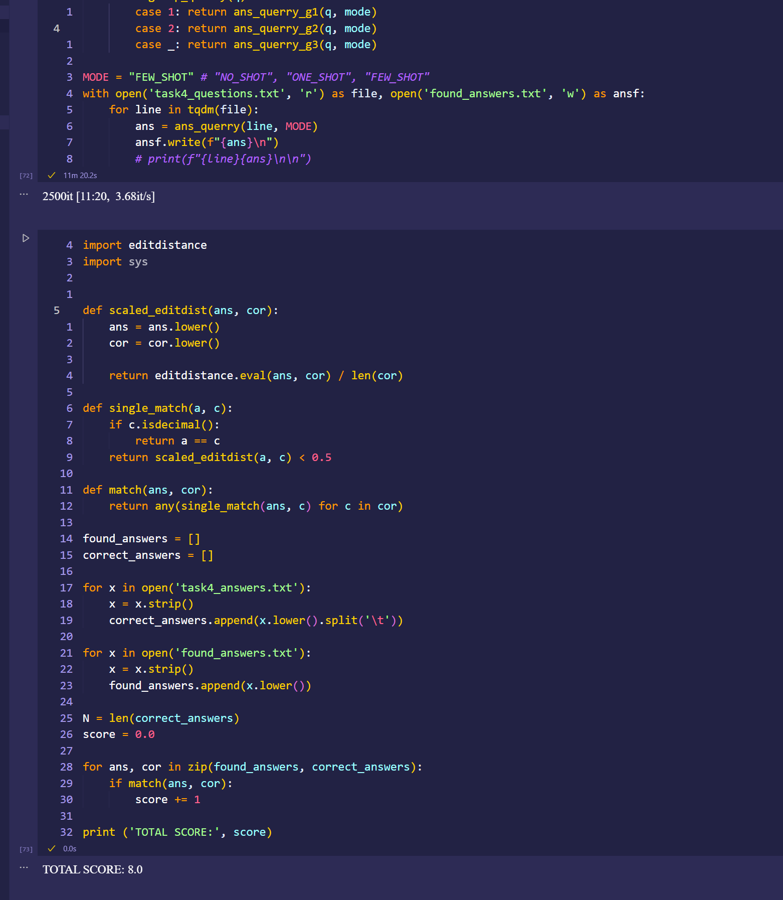

## zad 1

* **idea**: chciałem stworzych chatbota, który by mógł działać jak doradca klient w sklepie dla wspinaczy. 
* **prompt**: model w prompcie dostaje:
    * zarys tym kim jest: sprzedawcą w skleie
    * 8 ostatnich wymian zdań (4 zapytania klienta i 4 jego odpowiedzi)
    * najnowsze zapytanie klienta 
``` python
def __init__(self) -> None:
        self.chat_history: List[Tuple[str, str]] = []
        self.persona: str = "Sprzedawca w sklepie wspinaczkowym odpowiada na pytania klienta i mu pomaga. Odpowiada krótko i konkretnie po polsku. Jeśli brakuje danych, zadaje jedno pytanie doprecyzowujace"

def build_prompt(self) -> str:
        history = self.chat_history[-8:]
        
        conversation: List[str] = []
        conversation.append(f"{self.persona}")
        
        for role, text in history:
            conversation.append(f"{role}: {text}")
        conversation.append(f"Sprzedawca odpowiada:")
        return "\n".join(conversation)
```

* **heurystyka do wyboru odpowiedzi**: najpierw z 50 kandydatów które generuje wybieram 5 najlepszych na podstawie tego jakie znaki są w odpowiedzi modelu. Karam też model za używanie niektórych słów tak żeby nie pisał np "sprzedawca: mamy super buty do wspinaczki" a zamist tego po prostu "mamy super buty do wspinaczki". Jak już wybiore 5 najlepszych kandydatów to wybieram ten który ma największe prawdopodobieństwo bycia kontynuacją zdania "Sprzedawca w sklepie odpowiada na zapytanie klienta:"

``` python
 def heuristic(candidate: str) -> int:
            score = 0
            for char in candidate.lower():
                if  ord('a') <= ord(char) <= ord('z') or ord('0') <= ord(char) <= ord('9'):
                    score += 3
                elif char in [' ', ',', '.', '!', '?', 'ń', 'ż', 'ć', 'ź', 'ś', 'ó']:
                    score += 1
                else:
                    score -= 300
            
            for s in ['klient', 'sprzedawca', 'sprzedawcy', 'sprzedawcowi', 'sprzedający', 'klienta', 'rozmówca']:
                if s in candidate.lower(): score -= 10000
                
            user_input = ' '.join([text.lower() for (_, text) in self.chat_history[0::2]])
            for word in candidate.split():
                if word.lower() in user_input: score += 100
                    
            return score
        
        def log_probs_from_logits(logits, labels):
            logp = F.log_softmax(logits, dim=-1)
            logp_label = torch.gather(logp, 2, labels.unsqueeze(2)).squeeze(-1)
            return logp_label
        
        def sentence_prob(text):
            input_ids = tokenizer(f"Sprzedawca w sklepie odpowiada na zapytanie klienta: {text}", return_tensors='pt')['input_ids'].to(DEVICE)
            
            with torch.no_grad():
                output = model(input_ids=input_ids)
                log_probs = log_probs_from_logits(output.logits[:, :-1, :], input_ids[:, 1:])
                
            return float(log_probs[:, -1])
        
        k_best = list(sorted(candidates, key=heuristic, reverse=True)[:5])
        return max(k_best, key=sentence_prob)
```

---

## zad 4

w zadaniu 4 dziele zdania na 5 grup: 
1. zaczynajace się od "czy"
2. zaczynajace się od "ile" lub "z ilu" 
3. wszystko inne

zapytania z tych grup traktuje inaczej, dla grupy:
* 1: sprawdzam dopasowanie tak / nie do pytania z użyciem prawdopodobieństwa
* 2: generuje odpoweidzi i wybieram tą która ma w sobei jak najmniej nieporządanych znaków (czyli wszystko co nie jest cyfrą)
* 3: generuje odpowiedzi z których wybieram tą, kóra posiada jak najmniej dziwnych znaków (polskie znaki są dobre, wszystko inne złe)
## wyniki:
### no shot:


### one shot:


### few shot:

