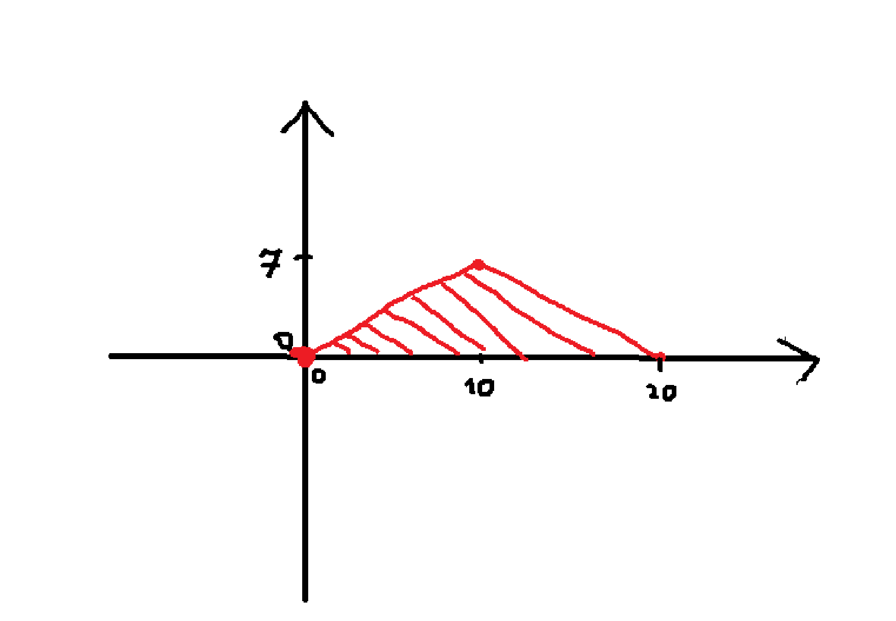

### Jakub Iliński 346796 zad1 rpis

--- 

### Dane:

    n := 9 + 1 = 10
    m := 6 + 1 = 7
    rozpatrujemy trójkąt o bokach (0, 0), (10, 7), (20, 0)
    na tym trójkącie zmienna (X, Y) ma stałą gęstość; f(x, y) = C

### Cel:

    wyznaczyć gęstość zmiennej T = 2X + Y

--- 

#### Wyznaczmy C = f(x, y):
* Całka z gęstości po całym obszarze musi wynosić 1
* $ 1 = C * Pole \ trójkąta $ 
* $ Pole \ trójkąta = \frac{1}{2} * 20 * 7 = 70$
* $C = \frac{1}{70}$

#### Analiza granic całkowania
* lewy bok trójkąta (0, 0) -> (10, 7), równanie prostej opisującej ten bok to $ y = \frac{7}{10}x $, czyli $ x = \frac{10}{7} y $ 
* prawy bok trójkąt (10, 7) -> (20, 0), równanie prostej opisującej ten bok to $ y = -\frac{7}{10}(x - 20) $, czyli $ x = 20 - \frac{10}{7}y $
* więc nasz obszar całkowania to:

$$
0 < y < 7 \\
\frac{10}{7}y  < x < 20 - \frac{10}{7}y
$$

#### Transformacja 
Wprowadźmy nowe zmienne:

    T = 2X + Y
    S = Y
więc:
* $ X = \frac{T - S}{2} $
* $ Y = S $
* liczymy jakobian tego przekształcenia:
$$ J = 
\begin{vmatrix}
    \frac{dx}{dt} & \frac{dx}{ds} \\
    \frac{dy}{dt} & \frac{dy}{ds}
\end{vmatrix} = 
\begin{vmatrix}
    \frac{1}{2} & -\frac{1}{2} \\
    0 & 1
\end{vmatrix}
= \frac{1}{2}
$$
* więc nowa gęstość zmiennych T, S wyraża sie wzorem:
$$
g(t, s) = f(x(t, s), y(t, s)) * |J| = \frac{1}{70} * \frac{1}{2} = \frac{1}{140}
$$

#### Nowe granice całkowania
$$
0 < S < 7 \\ 
\frac{10}{7}S < \frac{T - S}{2} < 20 - \frac{10}{7}S
$$
podzielny ostatnią nierówność i rozwiążmy osobno
* lewa strona:
$$
\frac{10}{7}S < \frac{T - S}{2} \\
\frac{20}{7}S < T - S \\ 
S < \frac{7}{27}T
$$
* prawa strona:
$$
\frac{T - S}{2} < 20 - \frac{10}{7}S \\ 
T - S < 40 - \frac{20}{7}S \\ 
S < \frac{7}{13}(40 - T)
$$

Więc S jest ograniczone przez: $ 0 < S < min(7, \frac{7}{27}T, \frac{7}{13}(40 - T)) $

Sprawdzmy gdzie te ograniczenia się przecinają:
$$
\frac{7}{27}T = \frac{7}{13}(40 - T) \\
13T = 1080 - 27T \\
T = 27
$$

Jak podstawimy T=27 do $\frac{7}{27}T$ to dostajemy 7 więc:
* Dla $ t \in (0, 27] $ ograniczeniem górnym dla S jest prosta $ \frac{7}{27}t $
* Dla $ t \in (27, 40) $ ograniczeniem górnym dla S jest prosta $ \frac{7}{13}(40 - t) $

#### liczenie gęstości $f_T(t)$
1. Przypadek $ 0 < t \leq 27 $:
$$
f_T(t) =
\int_0^\frac{7t}{27} \frac{1}{140} \ ds =
\frac{1}{140} [s]_0^\frac{7t}{27} =
\frac{1}{140} * \frac{7}{27}t = \frac{t}{540}
$$

2. Przypadek $ 27 < t < 40 $:
$$
f_T(t) = 
\int_0^{\frac{7}{13}(40 - t)} \frac{1}{140} \ ds = 
\frac{1}{140} [s]_0^{\frac{7}{13}(40 - t)} = 
\frac{1}{140} * \frac{7}{13}(40 - t) = \frac{40 - t}{260}
$$

--- 

### Podsumowanie
$ f_T(t) $ = $\frac{t}{540} $ dla $ t \in (0, 27] $
$ f_T(t) $ = $\frac{40 - t}{260} $ dla $ t \in (27, 40) $
$ f_T(t) $ = 0 wpp.

