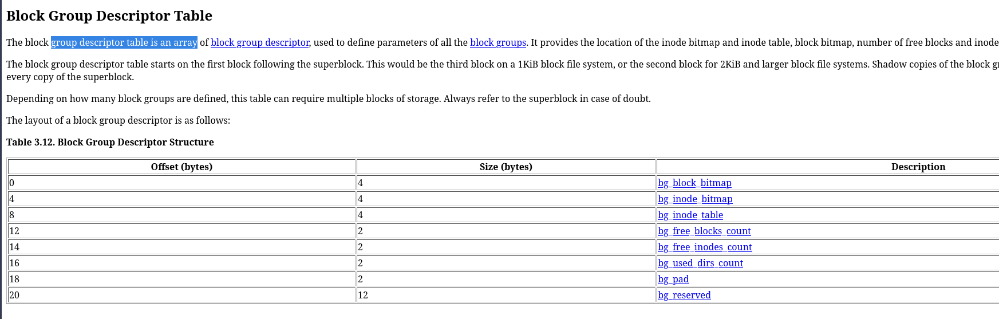
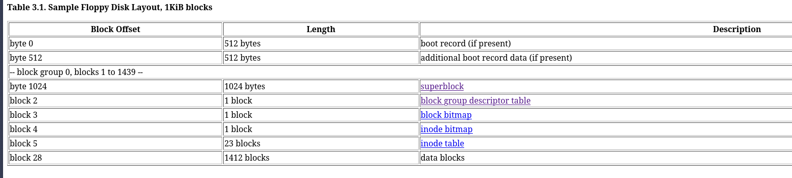
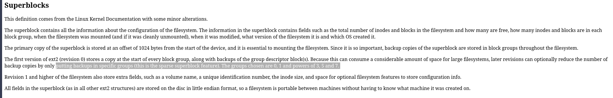

# zad2

---

* `superblok` - struktura przechowujaca metadane całęgo systemu plików 
* `blok` - najmniejsza jednostka adresacji danych na dysku 
* `grupa bloków` - połączenie bloków, które zmniejsza fragmentacje i pozwala na sekwencyjne odczyty
* `tablica desktruptorów grup bloków` - tablica rekordów opisujaca stan każdej grupy bloków

--- 

### wzór na wyliczenie artości
https://www.nongnu.org/ext2-doc/ext2.html#superblock

* rozmiar bloku: `block size = 1024 << s_log_block_size;`
* liczby i-węzłów: `s_inodes_count`
* bloków przechowywanych w grupie bloków: `s_blocks_per_group`
* liczba wpisów tablicy deskryptoróœ grup bloków: 
    jest równa liczbie grup bloków, bo kazdy wpis opisje jedną grupę
    `liczba wpisów = frac{s_blocks_count - s_first_data_block}{s_blocks_per_group}`

    czyli (całkowita liczba bloków - numer pierwszego loku danych)  / liczba bloków w jednej grupie

### składowe należące do grupy bloków i ich rozmiar w blokach 

### które grupy bloków przechowują kopie zapasowe superbloku i tablicy desktyptorów grup bloków
