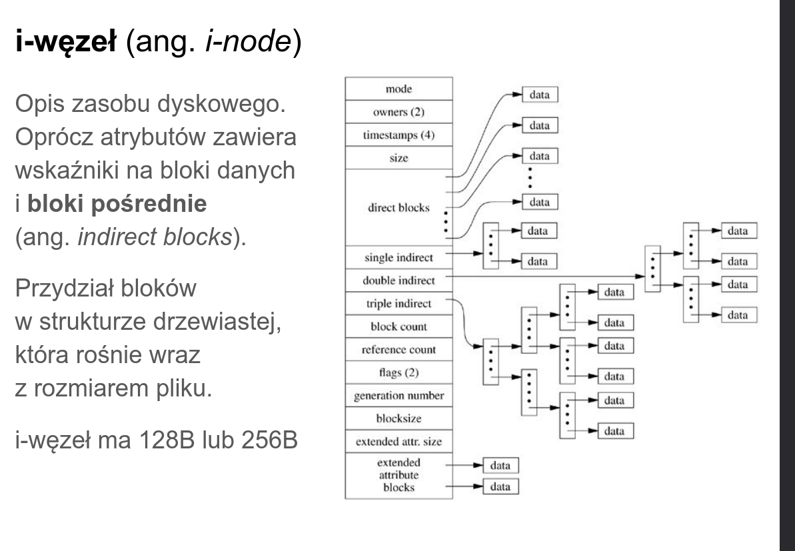

# zad 3 

---

* `blok pośredni` - blok który ne zawiera danych pliku, ale liste numerów kolejnych bloków danych. pozwala to na obsługę plików większych, niz mieści to tablica w i-węźle
* `wdrażanie synchroniczne` - so czeka na zakończenie zapisusu na dysku przed przejściem do kolejnego kroku. zapobiego tao utracie danych z buforów w razie awarii zasilania

--- 

### lista krokóœ niezbędnych do realiacji funkcji dopisującej n bloków na koniec pliku 

1. alokacja miejsca:
    * wczytujemy blok zawierający block bitmap
    * znajdujemy n bitów 0 i zamieniamy je na 1(zajęte)
    * aktualizacja zmian w block_bitmap na dysku

    (jeśli padnie prąd to będziemy mieli wyciek)
2. zapis danych 
    * zapisanie danych do wybranych boków
    * jeśli potrzebujemy bloku pośrednego, zaalokosujeby go (tak jak w 1.) i wypełniamy wskaźniki do blokóœ danych 

    (jeśli padnie prąd to stracimy dane al system plików pozostaje spójny, bo iwęzeł pokazuje stary poprawny stan)
3. aktualizacja iwęzła
    * wczytaj iwęzeł modyfikowanego piku
    * zaktualizucj wskaźniki (dopisujemy numery nowych bloków do talicy bezpośrednej lub bloków pośrednich)
    * aktualizacja metadanchy (size, czas modyfikacji, liczba bloków...)
    * zapisanie iwęzłą na dysk