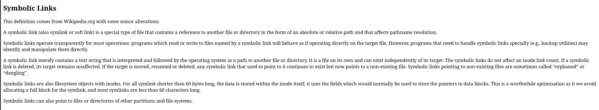

# zad 6

---

* `dowiązanie twarde` - dodatkowy wpis w katalogu wskazujący na ten same numer iwęzła co plik oryginalny. dla systemu plikóœ oba wpisy są równoważne i wskazują na te same dane
* `dowiązanie symboliczne` - plik, którego jedyna zawartością jest ścieżka tekstowwa wskazująca na inny plik lub ktalog w systemie

--- 

### gdzie jest przechowywana zawartosć dowiązania symbolicznego

### jak za pomocą dowiązania symbolicznego stworzyc w systemie plików pętle

    ln -s a b
    ln -s b a

### kiedy jądro systemu operacyjnego ja wykryje i zwróci `ELOOP` 

bład ELOOP (Too many levels of symbnolic links) dostaniemy podcas próby rozwiązania ścieżki.  jądro ma liczbik zagnieżdzeń gdy osiągniemy limit to oberacja jest przerywana ia zwracany jest błąd 

    cat a
    cat: a: Too many levels of symbolic links

### czemu pętli nie da sie zrobić z uzyciem dowiązaia twardego 

to zabezpieczenie systemow. zabrania one towrzenia dowiązań twardych do katalogów, bo struktura katalokœ ma być drzewem. gdyby dozwolony były twarde linki do ktalakogów możliwe by było tworzenie cykli w strukturze drzewa 

