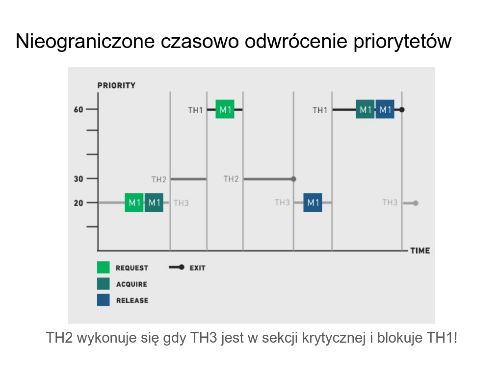
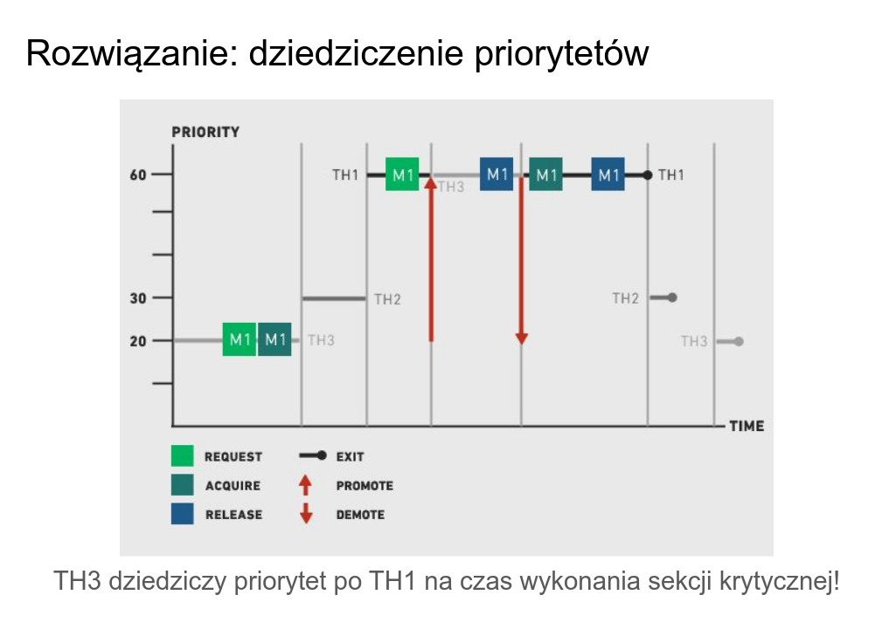

# zad 1

--- 

* `odwrócenie priorytetów` - gdy wątek o wysokim priorytecie musi czekać an wykonanie wątku o niższym, ponieważ ten drugi blokuje potrzebny zasób
* `dziedziczenie priorytetów`- mechanizm który pozwala by wątek o niskim priorytecie trzymajacy blokadę tymczasowo otrzymał wysoki priorytet taki sam jak czekający na zasób inny wątek. 
* `mutex` - semafro binarny który dodatkowo pamięta kto go założył

--- 

### w jaki sposób należy rozszeżyć implementację operacji `mutex_lock` i `mutex_unlock` by nie dopuścic do odwrócenia priorytetów

potrzebujemy:
* mutex musi znać swojego obecnego właściciela
* wątek musi pamiętać swób priorytet bierzący i oryginalny

mutex_lock:

    porównujemy priorytet bieżącego wątku z priorytetem właściciela
    jeśli priorytet(bieżacy wątek) > priorytet(wątek właściciela):
        zwięk proirytet wątku właściciela
        uśpij bieżący wątek 

mutex_unlock: 
    
    oddaj mutex
    obecny priorytet := oryginalny priorytet
    