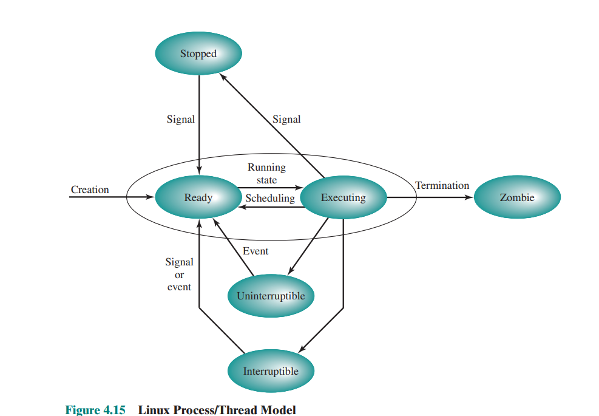

# zad 1 

---

* `stany procesu`: stan w wykonania w którym znajduje się proces
* `sen przerywalny`: proces znajduje się w stanie zablokowanym i czeka na jakieś zdarzenie systemowe. może zostać obudzony sygnałem 
* `sen nieprzyrywalny`: proces znajduje sie w stanie zablokowanym i czeka bezpośrednio na sprzęt np operację dyskową.  nie reaguje na żadne sygnały, czeka aż spręt mu odpowie
* `zablokowanie sygnału`:gdy sygnał został wysłany od procesu, ale proces tymczasowo go nie obsluguje
* `zignorowanie sygnału`: gdy proces całkowicie pomija dany sygnał, sygnał wtedy przepada

---

---

### stany w linux
* stopped - proces zatrzymany np przez `SIGSTOP` 
* ready -proces gotowy do wykonania, czeak w kolejce na przydzial CPU
* executing -proces aktualnie wykonywany w CPU
* uninterruptible - proces zablokowany na warunku sprzętkowym / input / optup, nie reaguje na sygnały
* interrutpible - proces zablokowany, czeka na zdarzenie input / output / zasób, może zostać obudzony sygnałem lub zdarzeniem
* zombie - proces zakońcozny, ale posiadający wpis w tablicy procesów, czeka aż rozdzić dobierze kod zakończenia

### akcje i zdarzenia zmieniające stan procesu

### które przejścia mogą być rezultatem działań podejmowanych przez:
* jądro: może zdecydować o przjściu pomiędzy  wszystkimi stanami
    * ready -> executing: scheduler wybiera proces i daje mu cpu
    * executing -> ready: scheduler odbiera CPU
    * executing -> interruptible / uninterruptible - proces wykonuje operacje I/O i jadro go blokuje do czasu zakończenia opearacji
    * interruptible / uninterruptible -> ready: jądro odblokowuje proces po nadejściu zdarzenia lub zakończeniu I/O
    * executing -> zombie: po wywołąniu exit() proces kończy sie ale jadro zostawia wpis do czasu wait() rodzica

* kod sterowników: często powodują zmine stanów procesów zmiązynaych z I\O
    * executing -> uninterruptible - proces wykonuje operację sprzętkową, sterownik blokuje go, dopóki sprzęt nie odpowie
    * uninterruptible -> ready - sterownik sygnalizuje zakończenie operacji 
* proces użytkownika: moze wykonać większosć przejsć: 
    * executing -> interruptible / uninterruptible: proces wykonuje I/O lub sleep()
    * executing -> stupped: inny proces wysyła `SIGSTOP` 
    * stopped -> ready: inny proces wyzyła `SIGCONFT`
    * exectuting -> zombie - wywołujac exit()

### sen przerywalny vs nieprzerywalny
przerywalny: proces śbi bo czeka na zdarzenie systemowe: 
* zakończenie I/O
* zwolnienie semafora
* przeyjscie sygnału od innego procesu
* wywolujac sleep()

nieprzerywalny: proces nie reaguje na żdene sygnały dopuki sprzęt nie skończy stojej operacji
* oczekuje na dane z dysku
* oczekuje na odpowiedź sterownika 
* dostęp do pamieci jądra lub sterownika

przeces w stanie przerywalnym moze zostać obudzony przez sygłał a nieprzerywalny nie może. dla nieprzeryalnego w `ps` taki proces ma stan `D` 

## czy proces może zablokować / zignorować sygnał 
* `sigkill` - nie
* `sigsegv` - nie można zablokowac, ale można zignorować lub obsłużyć handlrem. tylko że nie ma sensu, bo jeśli proces nie obsłuży tego sygnału to jądro natycmiast skończy działanie procesu z komunikatem `segmentation fault (core dumped)`. jeśli napiszemy handler to proces ma szanse na reakcje i zakończenie w kontrolowany ób 