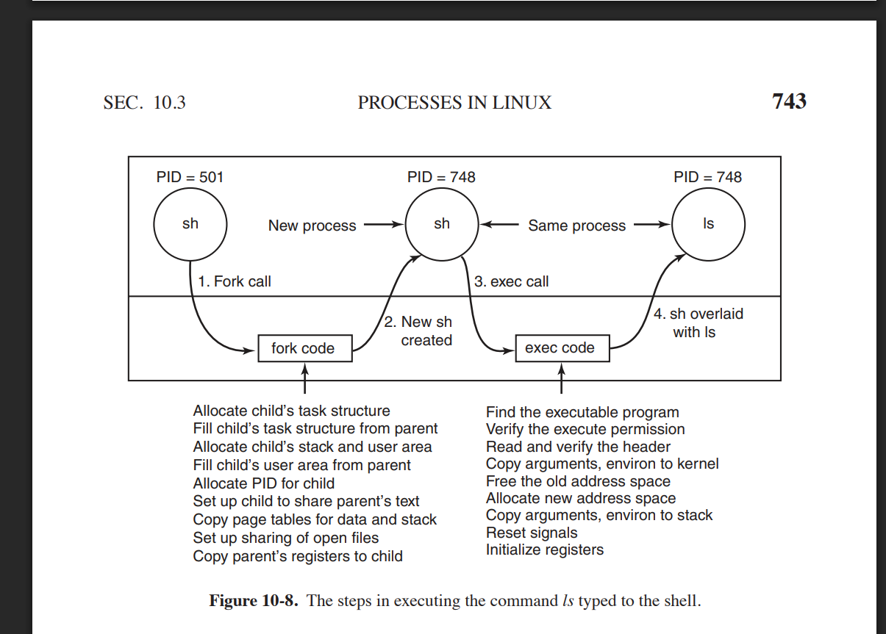

# zad 2 

---

* `oprzekierowanie (standardowego wejścia/wyjścia od/z pliku`) - podmiana standardowych strumieni procesu na pliki:
    * cmd < in.txt (stdin z pliku)
    * cmd > out.txt (nadpisanie pliku)
    * cmd >> out.txt (dopisz do pliku)
    * cmd 2> err.txt (przekierój strumień stderr do poliku, stdin nadal leci na terminal)
* `potok` - (pipe) jendokierunkowe połącznie między procesami. stdout jednego procesu idzie prosto na stdin drugiego.

---

---

### różnice w tworzeniu procesów na linux vs WinNT

1. Start:
    * Linux: dwuetapowy - najpierw fork() pottem execve()
    * Windows: jedno duże wywołanie CreateProcess które od razu tworzy nowy proces z wątkiem startowym 

2. co jest koiowane / współdzeloen na starcie: 
    * Linux: używa copy-on-write: dziecko ma własne tablice stron, ale wskazuje na strony rodzica read-only, kopia jest tworzona dopiero przy zapisie
    * Windows: nie robi kopii rodzica. ora razu tworzy nowy proces i mapuje do niego obraz pliku wykonywalnego

3. kto ustawia ukwyty i przekierowania:
    * Linux: powłoka po fork() w dziecku robie przekierowania i pipe'y. potem execve()
    * Windows: przekierowania i uchwyty podajemy od razu w parametrych CreateProcess. jądro tworzy nową tablicę uchwytów i duplikuje tylko te doswolone do dziedziczenia

4. Struktury jądra:
    * Linux: nie ma podzialu na wątki i procesy, są tylko taski oraz task_struct
    * Windows: jest rozróżnienie na wątki i procesy, windows ma osobny obiekt procesu i osobny obiekt wątku

5. Identyfikatory:
    * Linux: ma PID
    * osobne PID procesu i TDI wątku

6. start pierwszego wątku:
    * Linux: po execve() proces jest od razu gotowy do biegu
    * Windows: tworzy pierwszy tątek w stanie suspended, i dopiero potem faktycznie go ruuchamia

7. Identyfikatory i returny do wywołującego
    * Linux: fork() zwraca 0 w dziecku i PID w rodzicu 
    * Windows: zwracane są handlery i id nowego procesu 

### przebieg najwazniejszeych akcji podejmowanych przez jądro w trakcie obslugi fork() i execve()
1. fork - jadro tworzy dziecko z pcb, stosem jądra i przydziela mu nowy PID 
2. nowy proces jest stowrzony - ma on swój pid i identyczny obraz jak rodzic, jest gotowy do wykonania
3. exec call na pliku wykonywalny - dziecko woła exec, kernel znajduje plik wykonywalny, sprawdza uprawnienia
4. proces jest nadpisywany - kernel zwalnia starą przestrzeń, tworzy nową i mapuje obraz pliku wykonywalnego. wruzca argv/env na nowy stos, resetuej sygnały i rejestry

### dlaczenie nie możemy zastąpić fork i execve przez jedna funkcje, dlaczego w takim przypadku mielibyśmy problemy z dodaniem do powłoki obslugi przekierowania albo łączenia dowolnych procesów potokami

* fork() daje powłoce chwile zanim zostanie wywołany execve()
* powloka pomiędzy fork() a execve() robi:
    * towrzy potoki 
    * ustawia przekierowania do/ z pliku
    * ustawia grupy procesów, maski sygnałów, env...
    * zmienia katalog roboczy

gdybyśmy mieli funkcje spawn() to nie ma chwili pomiędzy opearcjami utworzenia nowego procesu i zaladowania do niego programu. w tech wili powłoka mogłaby cos skonfirgurować w procesie dziecka. czyli nie mamy okcaji zeby coś zrobić między tworzeniem a uruchamianiem programu 

gdyby istniała funkcja spawn to powloka nie mogłaby sama ustawic przekeirować, bo:
* nie mialaby jeszcze dostępu do pid dziecka
* nei mogłaby wejść do procesu dziecka i zmienić mu deskrytporów plików (bo każdy proces ma swoja osobną przestrzeń adresową)

w windowsie istnieje createProces() do którego przeba podawać wszystkie przekeirowanai, ychwyty, ścieżki w jednym dużym zestawie struktur