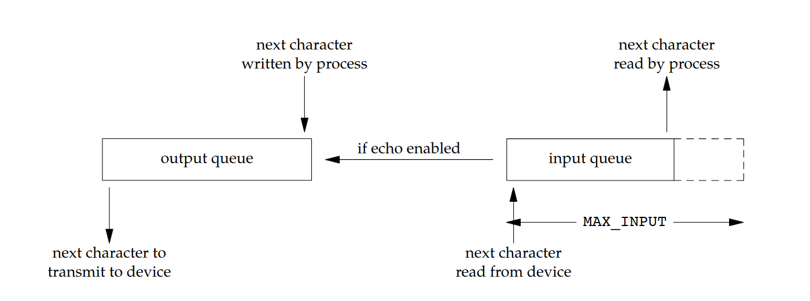
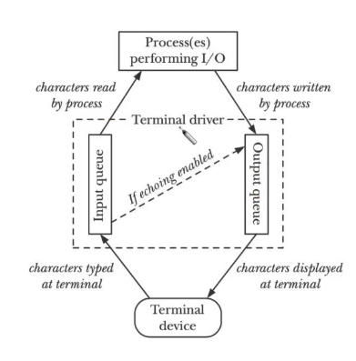

#zad2

---

* `tryb kanoniczny` - tryb w którym wejście z powłoki jest buforowane w liniach, edycja diała, read() zwraca co najwyżej jedną linię 
* `kolejka wejściowa` - bufor dla przychodzących znakow z terminala zanim zostana odczyatne przez proces.
* `kolejka wyjściowa` - bufor dla wysyłanych znaków 

---

termios: warstwa jądro <-> terminal która:
* buforeuj i przetwarza znaki wejścia i wyjścia
* egzekwuje job contlrol (fg/bg, sygnały z klawiatury),

terminal sterujący: 
* każda sesja moze mieć jeden 
* terminal zniknie -> `SIGHUP` do lidera

dostęp do terminala (job-control):
* czytanie:
    * fg: dozwolone
    * bg: jądro wyśle `SIGTTIN` całej grupie
* pisanie:
    * fg: dozwolone
    * bg: jeśli `TOSTOP` ustawione -> `SIGTTOU` do grupy, jeśli nie (defaultowo nie jest) -> zapis dozwolny

przetwarzanie wejścia (tryby):
* kanoniczny:
    * buforuje linie
    * można edytować linie (backspace, ctrl-u, ctrl-w)
    * read() zwróci co najwyżej jedną linie
* niekanoniczny
    * brak możliwości edycji lini

            stty -a wypisze ustawienia powłoki

--- 

### w jaki sposób sterownik terminala przetwara znaki wchodzące do kolejki wejściowej i kolejki wyjściowej

znaki z klawiatury trafiijna do bufora gdzie jadro przetwarza je według ustawień . w trybie kanonicznym łączy znaki w linie, obsługuje edycje (backspace, ctrl-u). Jeśli flaga `ISIG` jest włączona - ropoznaje kody sterujące (ctrl-c, ctrl-z) i wyyła odpowiednie sygnały. może też tłumaczyć znaki 

dane zapisne przez proces trafiaja do bufora i są modyfikowane np \n -> \r\n, taby zamieniane na spacje.

jeśli echo=1 każdy znak wpisywany przez uzytkonika który trafia do kolejki wejściowej jest natychmist kopiowany przez sterownik terminala do koeljki wyjściowej 

### jaką powinno się zmienić konfiguracje terminala na czas wpisywania hasła

podczas wpisywania haslo program powinien tymczasowo wylączyc echo, zeby wpisywane znaki nie były widoczne na ekranie

### czeu edytory takie jak vi konfigurują sterownik terminala do pracy w trybie niekanonicznym

* w trybie kanonicznym wejśice z klawiatury jest buforowane do momentu naciśnięcia enter. wiec vi nie mógł by reagować na pojedyńce klawisze np j

* w trybie niekanonicznym znaki są przekazywane natycmiast po naciśnięciu, bez czekania na enter i bez przetwarrzania (czyni np bez Ctlr-c)