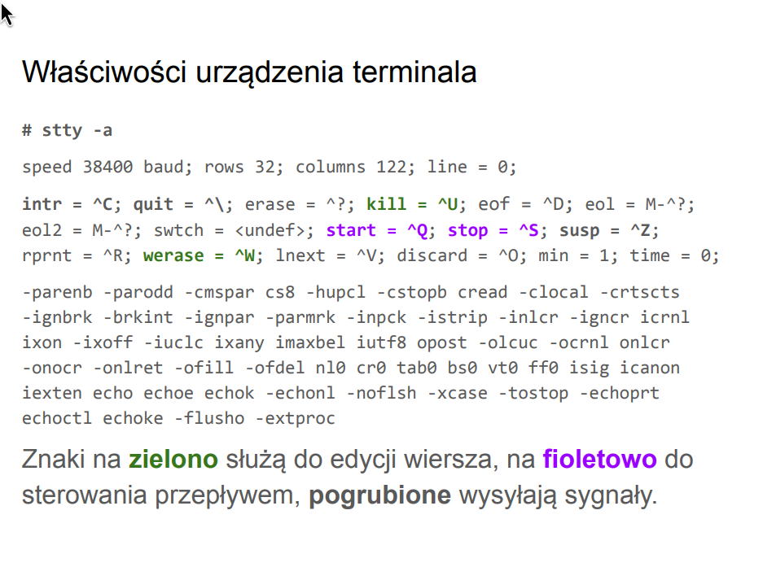

# zad3

---

### zarządzanie zadaniami

    intr    ^C      SIGINT
    quit    ^\      SIGQUIT
    susp    ^Z      SIGSTP

### edycja wiersza
    erase   ^?      backspace
    kill    ^U      usuwa całą bieżacą linie
    werase  ^W      usuwa ostatnie slowo 
    rprint  ^R      ponownie wypisuje bieżącą linię 
    lnext   ^V      pozwala wpisać następny znak np ^V
    discard ^O      włącza/wyłącza odrzucenie wyjścia
    eof     ^D      konic danych 

### jak program może zostać poinformowany o zmianie rozmiaru okna terminala. W tym celu musi zainstalowa ć procedure obsługi sygnału - którego? Jaka procedurą mozna wczytać nowy rozmiar okna

sygnał `SIGWINCH`
