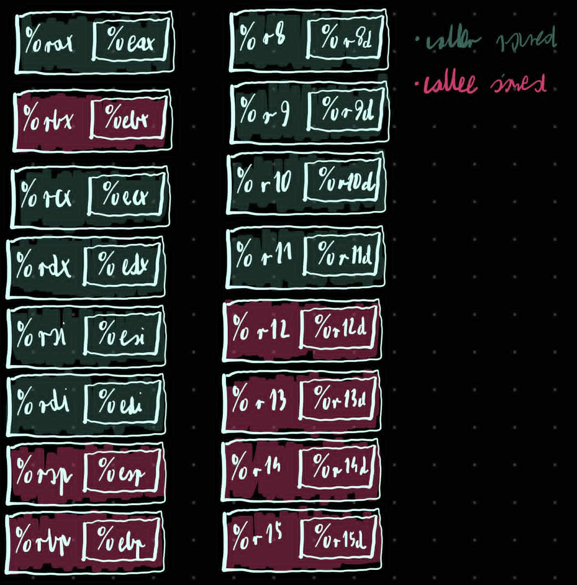

``` nasm
_JB_RBX = 0 
_JB_RBP = 1 
_JB_R12 = 2 
_JB_R13 = 3 
_JB_R14 = 4 
_JB_R15 = 5 
_JB_RSP = 6
_JB_RIP = 7

        .text

        .globl Setjmp
        .type Setjmp,@function
Setjmp: 	//setjmp(jmpBuf rdi) jmpBuf to tablica jednoelemntowa wiec rdi to wskaźnik
	movq    (%rsp),%r11					// r11 = *rsp, spamiętujemy gdzie Setjmp zostało wywołane. r11 jest caller saved wiec możemy go skobodnie używać 
	movq    %rbx,(_JB_RBX * 8)(%rdi)	// *(rdi) = rbx      env -> rbx = rbx
	movq    %rbp,(_JB_RBP * 8)(%rdi) 	// *(rdi + 1) = rpb 	env -> rbp = rbp
	movq    %r12,(_JB_R12 * 8)(%rdi)
	movq    %r13,(_JB_R13 * 8)(%rdi)
	movq    %r14,(_JB_R14 * 8)(%rdi)
	movq    %r15,(_JB_R15 * 8)(%rdi)
	movq    %rsp,(_JB_RSP * 8)(%rdi)	// *(rdi + 6) = rsp
	movq    %r11,(_JB_RIP * 8)(%rdi)	// *(rdi + 7) = miejsce w którym wywołaliśmy Setjmp
	xorl	%eax,%eax					// zwracamy 0
	ret
        .size Setjmp, . - Setjmp
        
        .globl Longjmp
        .type Longjmp,@function
Longjmp:	// longjump(jmpBuf rdi, int rsi) (env, val)
	movq    (_JB_RBX * 8)(%rdi),%rbx // rbx = *(rdi)
	movq    (_JB_RBP * 8)(%rdi),%rbp // rbp = *(rdi + 1)
	movq    (_JB_R12 * 8)(%rdi),%r12
	movq    (_JB_R13 * 8)(%rdi),%r13
	movq    (_JB_R14 * 8)(%rdi),%r14
	movq    (_JB_R15 * 8)(%rdi),%r15
	movq    (_JB_RSP * 8)(%rdi),%rsp
	movq    (_JB_RIP * 8)(%rdi),%r11
	movl	%esi,%eax 	// rax = rsi
	testl	%eax,%eax	// test rax
	jnz	1f				// if rax != 0 goto 1
	incl	%eax		// rax++	(jeśli wywołujemy rsi = 0 to zwracamy 1 a nie 0)
1:	movq	%r11,(%rsp)	// ustawiamy na top stosu r11 czyli env -> rip czyli adres powrotu pod który wrócimy z funkcji
	ret
        .size Longjmp, . - Longjmp

```


``` c
/* Setjmp & longjmp implementation without sigprocmask */
typedef struct {
  long rbx;
  long rbp;
  long r12;
  long r13;
  long r14;
  long r15;
  void *rsp;	// stack pointer
  void *rip;	// instruction pointer - adres powrotu f
} Jmpbuf[1];

```


* caller-saved 
	* odpowiedzialnosć za ich niezmiennośc spoczywa na caller
	* jeśli chce by ich wartości sie nie zmieniły to sam musi je zachować 
* callee-saved
	* odpowiedzialność za ich niezmienność spoczywa na callee
	* jeśli funkcja zmienia te rejestry najpierw musi je zapisaći przywrócić przed ret

* powrót z setjump zwraca 0 a powrót z longjump zwraca niezerową wartość, po to by odróżnić te przypadki

* setjmp(env) - zapisuje stan wybranych rejestrów w buforrze env i zwraca 0 

* longjmp(env, val) - odtwarza stan z env i wraca do punktu setjmp. 

* wszystkie te rejestry z Jmpbuf są callee-saved wiec muszą być zachowane przez funkcje wołaną 

* czemu tylko część rejestrów zapisujemy: 
	* %rsp i %rip po to by wrócić do tego samego miejsca w kodzie 
	* rejestry callee-saved, bo setjmp i longjmp są odpowiedzilane za ich niezmiennośc 
