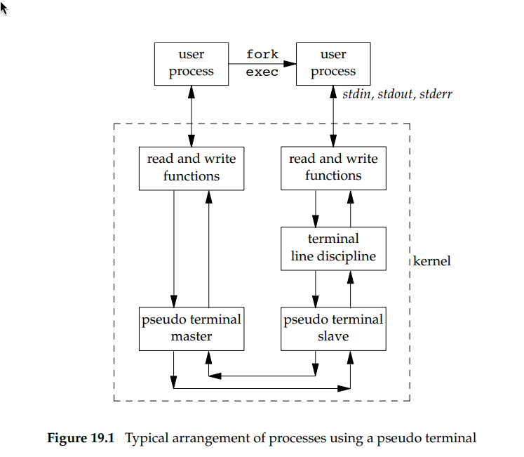
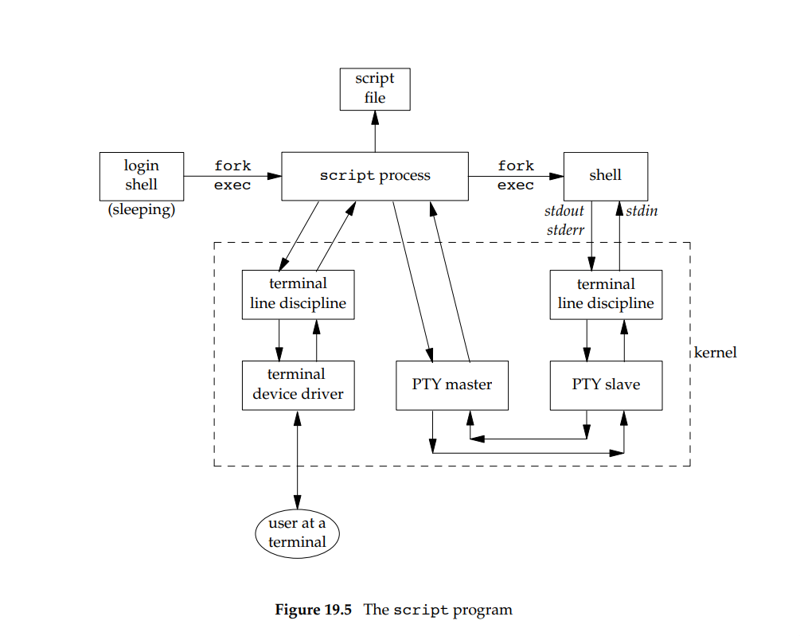

# zad 2

---




---

script to narzędzie które kopiuje cały ruch między powłoką a terminalem do pliku

script wstawia się między naszym terminalem a nową powłoką przy ućyciu pseudo termianlu PTY

* script otwiera PTY master i robi fork()
* dziecko tworzy nową sesję, otwiera PTY slave. PTY slave staje się terminalem sterującym tej powłoki


wszystko co powłoka wpisze po stronie PTY slave przechodzi przechodzi przez terminal line discipline i pojawia sie na pty master
* script czyta master i capisuje go do pliku

uruchamianie:
1. uruchamiamy script. logging schell robi fork + exec i potem śpi
2. script optwiera pty master
3. fork by rozdzielić na powłoke i terminal
    * dziecko: otwiera pty slave a potem exec shell
    * rodzic: zostaje z masterem

dane:
1. user przy terminalu coś wpisuje
2. terminal device driver 
3. terminal line discipline 
4. pty master
5. pty slave
6. terminal line discpiline 
7. shell

---
 nagranie:
`script -T timing -c dash`
`polecenia`
`exit(42)`

odtworzenie sesji:
`scriptreplay -t timing`

script.log
`strace -f -e read,write -o script.log script -T timing -c dash`

* 29519 - script 
* 2920 - dash 
* 2951 - ls 

jak script używa pseudotermianla do kuminijacjami z programami pdo kontrola dash

script (29519) czyta pojedyńcze znali z fd0 i pisze na fd5, po czym czya =z fd5 i wypisuje na fd1

fd dla script: 
* 0: stdin
* 1: stdout
* 5: pty master - główne lącze script i dash
* 8: plik typescript (log sesji)
* 9: plik timing


pokaż że sterownik termnala rpzepsuje znaku zgodnie z flagami ICRNL ONLCR
* icrnl: mapuje \r -> \n an input
* onlcr: mapute \n -> \r\n na output

``` bash
29519 read(0, "\r", 8192) = 1 
29519 write(5, "\r", 1) = 1 
29519 read(5, "\r\n", 8192) = 2 # zamiana \r inputu na \r\n
29520 ... read resumed, "ls\n"  # zamiana \r\n na \n dla inputu 
29519 write(1, "\r\n", 2) = 2
```

``` bash
29520 write(1, "hi\n", 3 <unfinished ...> 
29519 read(5, "\r\n", 8192) = 2 # zamiana \n na \r\n
29519 write(1, "\r\n", 2) = 2 
29519 read(5, "hi\r\n", 8192) = 4 
29519 write(1, "hi\r\n", 4) = 4
```


``` bash
29519 read(5, "\177ELF\2\1\1\3\0\0\0\0\0\0\0\0\3\0>\0\1\0\0\0000x\2\0\0\0\0\0"..., 832) = 832
29519 read(5, "# Locale name alias data base.\n#"..., 4096) = 2998
29519 read(5, "", 4096)                 = 0
29519 write(1, "Script started, output log file "..., 74) = 74
29519 read(9, "TZif2\0\0\0\0\0\0\0\0\0\0\0\0\0\0\0\0\0\0\v\0\0\0\v\0\0\0\0"..., 4096) = 2654
29519 read(9, "TZif2\0\0\0\0\0\0\0\0\0\0\0\0\0\0\0\0\0\0\v\0\0\0\v\0\0\0\0"..., 4096) = 1671
29520 read(5, "\177ELF\2\1\1\0\0\0\0\0\0\0\0\0\3\0>\0\1\0\0\0 {\0\0\0\0\0\0"..., 832) = 832
29520 read(5, "\177ELF\2\1\1\0\0\0\0\0\0\0\0\0\3\0>\0\1\0\0\0\0\0\0\0\0\0\0\0"..., 832) = 832
29520 read(5, "\177ELF\2\1\1\3\0\0\0\0\0\0\0\0\3\0>\0\1\0\0\0\0\0\0\0\0\0\0\0"..., 832) = 832
29520 read(5, "\177ELF\2\1\1\3\0\0\0\0\0\0\0\0\3\0>\0\1\0\0\0000x\2\0\0\0\0\0"..., 832) = 832
29520 read(11, "# Name Service Switch configurat"..., 4096) = 359
29520 read(11, "", 4096)                = 0
29520 read(11, "root:x:0:0::/root:/usr/bin/bash\n"..., 4096) = 1579
29520 read(11, "1000", 12)              = 4
29520 read(11, "root:x:0:0::/root:/usr/bin/bash\n"..., 4096) = 1579
29520 read(5, "\177ELF\2\1\1\0\0\0\0\0\0\0\0\0\3\0>\0\1\0\0\0\0\0\0\0\0\0\0\0"..., 832) = 832
29520 read(5, "\177ELF\2\1\1\3\0\0\0\0\0\0\0\0\3\0>\0\1\0\0\0000x\2\0\0\0\0\0"..., 832) = 832
29520 read(5, "\177ELF\2\1\1\0\0\0\0\0\0\0\0\0\3\0>\0\1\0\0\0\0\0\0\0\0\0\0\0"..., 832) = 832
29520 write(2, "$ ", 2)                 = 2
29520 read(0 <unfinished ...>
29519 read(5, "$ ", 8192)               = 2
29519 write(1, "$ ", 2)                 = 2
29519 read(0, "l", 8192)                = 1
29519 write(5, "l", 1)                  = 1
29519 read(5, "l", 8192)                = 1
29519 write(1, "l", 1)                  = 1
29519 read(0, "s", 8192)                = 1
29519 write(5, "s", 1)                  = 1
29519 read(5, "s", 8192)                = 1
29519 write(1, "s", 1)                  = 1
29519 read(0, "\r", 8192)               = 1
29519 write(5, "\r", 1)                 = 1
29519 read(5, "\r\n", 8192)             = 2
29520 <... read resumed>, "ls\n", 8192) = 3
29519 write(1, "\r\n", 2)               = 2
29521 read(5, "\177ELF\2\1\1\0\0\0\0\0\0\0\0\0\3\0>\0\1\0\0\0 {\0\0\0\0\0\0"..., 832) = 832
29521 read(5, "\177ELF\2\1\1\3\0\0\0\0\0\0\0\0\3\0>\0\1\0\0\0000x\2\0\0\0\0\0"..., 832) = 832
29521 write(1, "cnt  img  script.log  so21_lista"..., 90) = 90
29519 read(5, "cnt  img  script.log  so21_lista"..., 8192) = 91
29521 +++ exited with 0 +++
29519 write(1, "cnt  img  script.log  so21_lista"..., 91) = 91
29520 --- SIGCHLD {si_signo=SIGCHLD, si_code=CLD_EXITED, si_pid=29521, si_uid=1000, si_status=0, si_utime=0, si_stime=0} ---
29520 write(2, "$ ", 2)                 = 2
29520 read(0 <unfinished ...>
29519 read(5, "$ ", 8192)               = 2
29519 write(1, "$ ", 2)                 = 2
29519 read(0, "p", 8192)                = 1
29519 write(5, "p", 1)                  = 1
29519 read(5, "p", 8192)                = 1
29519 write(1, "p", 1)                  = 1
29519 read(0, "w", 8192)                = 1
29519 write(5, "w", 1)                  = 1
29519 read(5, "w", 8192)                = 1
29519 write(1, "w", 1)                  = 1
29519 read(0, "d", 8192)                = 1
29519 write(5, "d", 1)                  = 1
29519 read(5, "d", 8192)                = 1
29519 write(1, "d", 1)                  = 1
29519 read(0, "\r", 8192)               = 1
29519 write(5, "\r", 1)                 = 1
29519 read(5, "\r\n", 8192)             = 2
29519 write(1, "\r\n", 2 <unfinished ...>
29520 <... read resumed>, "pwd\n", 8192) = 4
29519 <... write resumed>)              = 2
29520 write(1, "/home/hinski2/Programowanie/scho"..., 45) = 45
29519 read(5, "/home/hinski2/Programowanie/scho"..., 8192) = 46
29519 write(1, "/home/hinski2/Programowanie/scho"..., 46) = 46
29520 write(2, "$ ", 2)                 = 2
29520 read(0 <unfinished ...>
29519 read(5, "$ ", 8192)               = 2
29519 write(1, "$ ", 2)                 = 2
29519 read(0, "e", 8192)                = 1
29519 write(5, "e", 1)                  = 1
29519 read(5, "e", 8192)                = 1
29519 write(1, "e", 1)                  = 1
29519 read(0, "c", 8192)                = 1
29519 write(5, "c", 1)                  = 1
29519 read(5, "c", 8192)                = 1
29519 write(1, "c", 1)                  = 1
29519 read(0, "h", 8192)                = 1
29519 write(5, "h", 1)                  = 1
29519 read(5, "h", 8192)                = 1
29519 write(1, "h", 1)                  = 1
29519 read(0, "o", 8192)                = 1
29519 write(5, "o", 1)                  = 1
29519 read(5, "o", 8192)                = 1
29519 write(1, "o", 1)                  = 1
29519 read(0, " ", 8192)                = 1
29519 write(5, " ", 1)                  = 1
29519 read(5, " ", 8192)                = 1
29519 write(1, " ", 1)                  = 1
29519 read(0, "h", 8192)                = 1
29519 write(5, "h", 1)                  = 1
29519 read(5, "h", 8192)                = 1
29519 write(1, "h", 1)                  = 1
29519 read(0, "i", 8192)                = 1
29519 write(5, "i", 1)                  = 1
29519 read(5, "i", 8192)                = 1
29519 write(1, "i", 1)                  = 1
29519 read(0, "\r", 8192)               = 1
29519 write(5, "\r", 1)                 = 1
29520 <... read resumed>, "echo hi\n", 8192) = 8
29520 write(1, "hi\n", 3 <unfinished ...>
29519 read(5, "\r\n", 8192)             = 2
29519 write(1, "\r\n", 2)               = 2
29520 <... write resumed>)              = 3
29519 read(5, "hi\r\n", 8192)           = 4
29519 write(1, "hi\r\n", 4)             = 4
29520 write(2, "$ ", 2)                 = 2
29520 read(0 <unfinished ...>
29519 read(5, "$ ", 8192)               = 2
29519 write(1, "$ ", 2)                 = 2
29519 read(0, "e", 8192)                = 1
29519 write(5, "e", 1)                  = 1
29519 read(5, "e", 8192)                = 1
29519 write(1, "e", 1)                  = 1
29519 read(0, "x", 8192)                = 1
29519 write(5, "x", 1)                  = 1
29519 read(5, "x", 8192)                = 1
29519 write(1, "x", 1)                  = 1
29519 read(0, "i", 8192)                = 1
29519 write(5, "i", 1)                  = 1
29519 read(5, "i", 8192)                = 1
29519 write(1, "i", 1)                  = 1
29519 read(0, "t", 8192)                = 1
29519 write(5, "t", 1)                  = 1
29519 read(5, "t", 8192)                = 1
29519 write(1, "t", 1)                  = 1
29519 read(0, " ", 8192)                = 1
29519 write(5, " ", 1)                  = 1
29519 read(5, " ", 8192)                = 1
29519 write(1, " ", 1)                  = 1
29519 read(0, "4", 8192)                = 1
29519 write(5, "4", 1)                  = 1
29519 read(5, "4", 8192)                = 1
29519 write(1, "4", 1)                  = 1
29519 read(0, "2", 8192)                = 1
29519 write(5, "2", 1)                  = 1
29519 read(5, "2", 8192)                = 1
29519 write(1, "2", 1)                  = 1
29519 read(0, "\r", 8192)               = 1
29519 write(5, "\r", 1)                 = 1
29520 <... read resumed>, "exit 42\n", 8192) = 8
29519 read(5, "\r\n", 8192)             = 2
29519 write(1, "\r\n", 2)               = 2
29520 +++ exited with 42 +++
29519 read(7, "\21\0\0\0\0\0\0\0\1\0\0\0Ps\0\0\350\3\0\0\0\0\0\0\0\0\0\0\0\0\0\0"..., 128) = 128
29519 write(8, "Script started on 2025-11-05 12:"..., 358) = 358
29519 write(9, "0.004558 2\n0.987853 1\n0.051333 1"..., 332) = 332
29519 write(1, "Script done.\n", 13)    = 13
29519 +++ exited with 0 +++

```