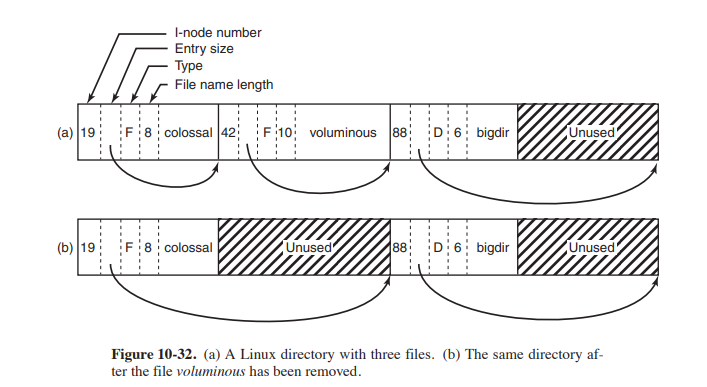

# zad3

---

* `nieużytki` - wewnętrzna wolna przestrzeń w katalogo plików
* `kompaktowanie katalogu` - proces scalania i przesówania wpisów by zmienijszyć nieużytki

---



``` c
typedef struct {
    ino_t           d_fileno;   // file unique id
    uint16_t        d_reclen;   // lenght in pytes of the directory record 
    uint16_t        d_namlen;   // lentgh of file name
    uint8_t         d_type;     // type of the file
    char            d_name[MAXNAMLEN + 1];  // nul terminated file name 
} dirent;


```

available d_types:

    Dirent         Stat           Description
    DT_UNKNOWN     -              unknown file type
    DT_FIFO        S_IFIFO        named pipe
    DT_CHR         S_IFCHR        character device
    DT_DIR         S_IFDIR        directory
    DT_BLK         S_IFBLK        block device
    DT_REG         S_IFREG        regular file
    DT_LNK         S_IFLNK        symbolic link
    DT_SOCK        S_IFSOCK       UNIX domain socket
    DT_WHT         S_IFWHT        dummy ``whiteout inode''

---

#### operacja usuwanai i dodawnia pliku gdzie za lub przed katalogime istenije nieużytek 
sytuacja: [a][x][nieurzytek][b], chcemy usunąć x

1. zwiększ a.d_reclen o x.d_reclen
2. wyczyść pola x
dzięki temu a wskazuje na początek b

sytuacja: [a][nieurzytek][x][b]
1. zwiększ a.d_reclen o x.d_reclen
2. wyczyść pola x 
więc a wskazuje na początek b

gdy chcemy dodać. dla każdego wpisu liczymy jego minimalny rozmiar, tak żeby dostać rozmiar nieurzytku.
* opcja: nowy katalog się mieści w nieużytek -> wtedy go tam dodajemy i zmieniamy reclen
* opcja: nowy katalog się ne mieści ale jest wystarczająco dużo miejsca na końcu -> dodajemy go na koniec
* opcja: nowy katalog się nie mieści w żaden nieużytek -> wtedy system plików alokuje nowy blok takalogu i umieszczamy na końcu nowy plik

#### kiedy jądro leniwie wykonuje operacje kompaktowania na katalogach
* podczas usuwania wolna przestrzeń w tym samym bloku lączy się w lewo
* podczas dodawania zanim zaalokujemy nowy blok próbujemy upakować nowy plik w nieużytek 