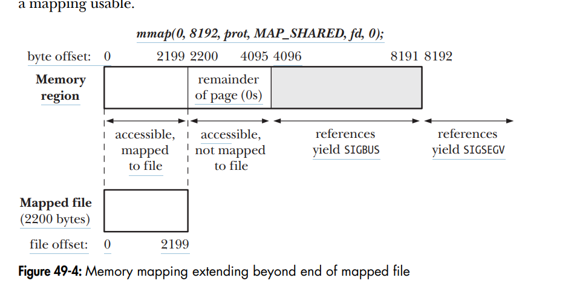

# zad 2 

--- 

### prywatne mapowanie pliku
* służy do mapowania zawartości pliku w sposób bezpieczny dla oryginału
* so używa tego mapowania do inicjalizowania segmentu .txt, .data. lub do łądowania bibliotek współdzelonych

### prywatne mapowanie anonimowe
* prośba o czystą pamięć ram
* służy do alokacji nowej pamięci dla procesu, która jest wypełniona zerami. funkcja mallow() wykorzystuje ten mechanizm 

### współdzielone mapowanie pliku
* praca na oryginalnym pliku, zmiany są widoczne dla wszystkich i trafiają na dysk
* alternatywa dla funkcji read / write
* IPC (komunikacja między procesami), pozwala niezpokrewnionym procesom współdzielić region pamięci

### współdzielone mapowanie anonimowe
* służy do kuminikacji, bez użycia pliku na dysku
* IPC pomiędzy spokrewnionymi procesami. dziecko dziedziczy mapowanie współdzielone po fork() i dzięki niemu moze komunikować się z rodzicem

---

### co się dizeje z odwzorowaniami po wywołaniu fork(2)
* proces potomny dziedziczy wszystkie mapowania pamięci (plikowe i naonimowe)
* dla prywatnego mapowania:
    używa sie copy on write 
* dla współdzelonego:
    strony pamięci nie są kopiowane przy zapisie

### czy execve(2) tworzy odwzorowaniea prywatne czy dzielone
execve nie tworzy odzroworań, służy tylkop do wymiany "muzgu". wyrzuca on stare mapowania.
.text, .data i biblioteki współdzielone są maja mapowanie prywatne

## w jaki sposób jądro systemu automatycznie zwiększa rozmiar stosu do ustalonego limitu
* próbujemy oddać coś na stos. nie ma miejsca
* dostajemy page fault, idziemy do jądra by go obsłużyć
* jądro psrawdza czy zwiększenie stosu nie przekroczy jego dopuszczalnego limitu
* jeśli może zwiększyć używam mmap do zmapowania pamięci i wznawia program
* jeśli nie segfault

### keidy jądro wyśle sygnał `SIGBUS` do procesu posiadającego odwzorowanie pliuk w pamięć 

robimy mapowanie które jest większe niż plik -> robi się zaookrąblienie do najbliższej wielokrotności 4096
jeśli zrobimy mapowanie które jest jeszcze większe niż zaaokrąglenie w góre to nic się nie stanie dopuki nie będziemy sie chcieli dostać do tej pamięci. wtedy dostaniemy SIGBUS
