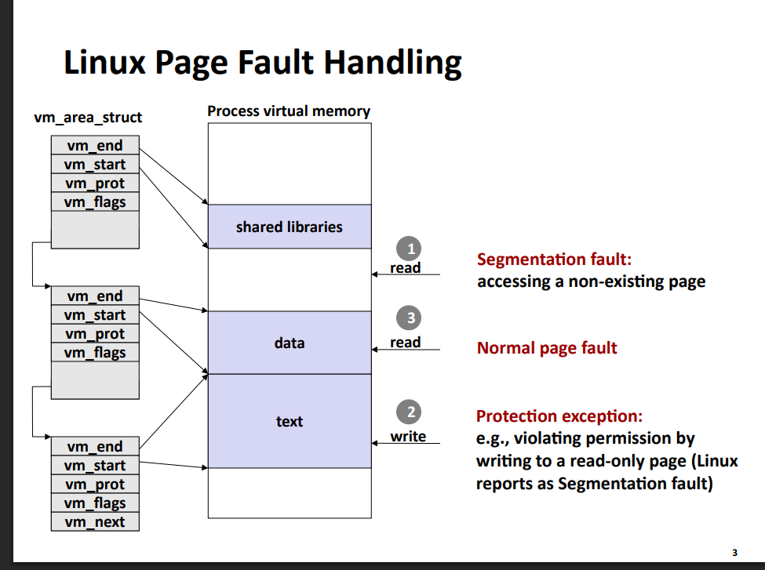

# zad 4 

---- 

* `minor page fault` - gdy strona nie jest w ram, ale nie wymaga odczytu z dysku, np gdy storna musi by zainicjalizowana zerami.
* `major page fault` - gdy strona nie jest w ramie i wymaga załądawanie jej zawartości z dysku 
* `bufor stron` - cache ale dla bloków danych z plików 

---

### algorytm stronnicowania


1. mmu zgłasza błąd strony 
2. weryfikacja adresu
    jądro sprawdza czy adres wirtulany leży wewnątrz któgegoś ze zdefiniowanyc obszarów pamięci procesu. Jesli adres nie zostaje znaleziony to proces otymuje SIGSEGV 
3. weryfikacja uprawnień
    adres został znaleziony, jądro sprawdza czy dostęp do tego adresu jest legalny. jeśli nie niest legalny to dostajemy SIGSEGV
4. normal page fault
    adres jest poprawny i mamy odpowoednie uprawnienia. Jądro alokuje fizyczna ramke pamięci, wczytuje odpowiednie dane, aktualizuje tablice stron i wznawia instrukcje która spowodowałą bląd 

### jakie inforamcje musi dostarczyć procesor, zeby można było wykonać procedurę obsługi błędu stonnicowania
* adres wirtulanyk który spowodował bląd 
* tryb odczytu (read/write/execute)
* adres instrukcji która wywołała błąd. by wiedzieć gdzi wrócić 

### do czego służą te struktury jadra
mm_struct::pgd

``` c
typedef struct {
	DECLARE_BITMAP(__mm_flags, NUM_MM_FLAG_BITS);
} __private mm_flags_t;

struct kioctx_table;
struct iommu_mm_data;
struct mm_struct {
	struct {
		/*
		 * Fields which are often written to are placed in a separate
		 * cache line.
		 */
		struct {
			/**
			 * @mm_count: The number of references to &struct
			 * mm_struct (@mm_users count as 1).
			 *
			 * Use mmgrab()/mmdrop() to modify. When this drops to
			 * 0, the &struct mm_struct is freed.
			 */
			atomic_t mm_count;
		} ____cacheline_aligned_in_smp;

		struct maple_tree mm_mt;

		unsigned long mmap_base;	/* base of mmap area */
		unsigned long mmap_legacy_base;	/* base of mmap area in bottom-up allocations */
#ifdef CONFIG_HAVE_ARCH_COMPAT_MMAP_BASES
		/* Base addresses for compatible mmap() */
		unsigned long mmap_compat_base;
		unsigned long mmap_compat_legacy_base;
#endif
		unsigned long task_size;	/* size of task vm space */
		pgd_t * pgd;

#ifdef CONFIG_MEMBARRIER
		/**
		 * @membarrier_state: Flags controlling membarrier behavior.
		 *
		 * This field is close to @pgd to hopefully fit in the same
		 * cache-line, which needs to be touched by switch_mm().
		 */
		atomic_t membarrier_state;
#endif

		/**
		 * @mm_users: The number of users including userspace.
		 *
		 * Use mmget()/mmget_not_zero()/mmput() to modify. When this
		 * drops to 0 (i.e. when the task exits and there are no other
		 * temporary reference holders), we also release a reference on
		 * @mm_count (which may then free the &struct mm_struct if
		 * @mm_count also drops to 0).
		 */
		atomic_t mm_users;

#ifdef CONFIG_SCHED_MM_CID
		/**
		 * @pcpu_cid: Per-cpu current cid.
		 *
		 * Keep track of the currently allocated mm_cid for each cpu.
		 * The per-cpu mm_cid values are serialized by their respective
		 * runqueue locks.
		 */
		struct mm_cid __percpu *pcpu_cid;
		/*
		 * @mm_cid_next_scan: Next mm_cid scan (in jiffies).
		 *
		 * When the next mm_cid scan is due (in jiffies).
		 */
		unsigned long mm_cid_next_scan;
		/**
		 * @nr_cpus_allowed: Number of CPUs allowed for mm.
		 *
		 * Number of CPUs allowed in the union of all mm's
		 * threads allowed CPUs.
		 */
		unsigned int nr_cpus_allowed;
		/**
		 * @max_nr_cid: Maximum number of allowed concurrency
		 *              IDs allocated.
		 *
		 * Track the highest number of allowed concurrency IDs
		 * allocated for the mm.
		 */
		atomic_t max_nr_cid;
		/**
		 * @cpus_allowed_lock: Lock protecting mm cpus_allowed.
		 *
		 * Provide mutual exclusion for mm cpus_allowed and
		 * mm nr_cpus_allowed updates.
		 */
		raw_spinlock_t cpus_allowed_lock;
#endif
#ifdef CONFIG_MMU
		atomic_long_t pgtables_bytes;	/* size of all page tables */
#endif
		int map_count;			/* number of VMAs */

		spinlock_t page_table_lock; /* Protects page tables and some
					     * counters
					     */
		/*
		 * Typically the current mmap_lock's offset is 56 bytes from
		 * the last cacheline boundary, which is very optimal, as
		 * its two hot fields 'count' and 'owner' sit in 2 different
		 * cachelines, and when mmap_lock is highly contended, both
		 * of the 2 fields will be accessed frequently, current layout
		 * will help to reduce cache bouncing.
		 *
		 * So please be careful with adding new fields before
		 * mmap_lock, which can easily push the 2 fields into one
		 * cacheline.
		 */
		struct rw_semaphore mmap_lock;

		struct list_head mmlist; /* List of maybe swapped mm's.	These
					  * are globally strung together off
					  * init_mm.mmlist, and are protected
					  * by mmlist_lock
					  */
#ifdef CONFIG_PER_VMA_LOCK
		struct rcuwait vma_writer_wait;
		/*
		 * This field has lock-like semantics, meaning it is sometimes
		 * accessed with ACQUIRE/RELEASE semantics.
		 * Roughly speaking, incrementing the sequence number is
		 * equivalent to releasing locks on VMAs; reading the sequence
		 * number can be part of taking a read lock on a VMA.
		 * Incremented every time mmap_lock is write-locked/unlocked.
		 * Initialized to 0, therefore odd values indicate mmap_lock
		 * is write-locked and even values that it's released.
		 *
		 * Can be modified under write mmap_lock using RELEASE
		 * semantics.
		 * Can be read with no other protection when holding write
		 * mmap_lock.
		 * Can be read with ACQUIRE semantics if not holding write
		 * mmap_lock.
		 */
		seqcount_t mm_lock_seq;
#endif
#ifdef CONFIG_FUTEX_PRIVATE_HASH
		struct mutex			futex_hash_lock;
		struct futex_private_hash	__rcu *futex_phash;
		struct futex_private_hash	*futex_phash_new;
		/* futex-ref */
		unsigned long			futex_batches;
		struct rcu_head			futex_rcu;
		atomic_long_t			futex_atomic;
		unsigned int			__percpu *futex_ref;
#endif

		unsigned long hiwater_rss; /* High-watermark of RSS usage */
		unsigned long hiwater_vm;  /* High-water virtual memory usage */

		unsigned long total_vm;	   /* Total pages mapped */
		unsigned long locked_vm;   /* Pages that have PG_mlocked set */
		atomic64_t    pinned_vm;   /* Refcount permanently increased */
		unsigned long data_vm;	   /* VM_WRITE & ~VM_SHARED & ~VM_STACK */
		unsigned long exec_vm;	   /* VM_EXEC & ~VM_WRITE & ~VM_STACK */
		unsigned long stack_vm;	   /* VM_STACK */
		vm_flags_t def_flags;

		/**
		 * @write_protect_seq: Locked when any thread is write
		 * protecting pages mapped by this mm to enforce a later COW,
		 * for instance during page table copying for fork().
		 */
		seqcount_t write_protect_seq;

		spinlock_t arg_lock; /* protect the below fields */

		unsigned long start_code, end_code, start_data, end_data;
		unsigned long start_brk, brk, start_stack;
		unsigned long arg_start, arg_end, env_start, env_end;

		unsigned long saved_auxv[AT_VECTOR_SIZE]; /* for /proc/PID/auxv */

#ifdef CONFIG_ARCH_HAS_ELF_CORE_EFLAGS
		/* the ABI-related flags from the ELF header. Used for core dump */
		unsigned long saved_e_flags;
#endif

		struct percpu_counter rss_stat[NR_MM_COUNTERS];

		struct linux_binfmt *binfmt;

		/* Architecture-specific MM context */
		mm_context_t context;

		mm_flags_t flags; /* Must use mm_flags_* hlpers to access */

#ifdef CONFIG_AIO
		spinlock_t			ioctx_lock;
		struct kioctx_table __rcu	*ioctx_table;
#endif
#ifdef CONFIG_MEMCG
		/*
		 * "owner" points to a task that is regarded as the canonical
		 * user/owner of this mm. All of the following must be true in
		 * order for it to be changed:
		 *
		 * current == mm->owner
		 * current->mm != mm
		 * new_owner->mm == mm
		 * new_owner->alloc_lock is held
		 */
		struct task_struct __rcu *owner;
#endif
		struct user_namespace *user_ns;

		/* store ref to file /proc/<pid>/exe symlink points to */
		struct file __rcu *exe_file;
#ifdef CONFIG_MMU_NOTIFIER
		struct mmu_notifier_subscriptions *notifier_subscriptions;
#endif
#if defined(CONFIG_TRANSPARENT_HUGEPAGE) && !defined(CONFIG_SPLIT_PMD_PTLOCKS)
		pgtable_t pmd_huge_pte; /* protected by page_table_lock */
#endif
#ifdef CONFIG_NUMA_BALANCING
		/*
		 * numa_next_scan is the next time that PTEs will be remapped
		 * PROT_NONE to trigger NUMA hinting faults; such faults gather
		 * statistics and migrate pages to new nodes if necessary.
		 */
		unsigned long numa_next_scan;

		/* Restart point for scanning and remapping PTEs. */
		unsigned long numa_scan_offset;

		/* numa_scan_seq prevents two threads remapping PTEs. */
		int numa_scan_seq;
#endif
		/*
		 * An operation with batched TLB flushing is going on. Anything
		 * that can move process memory needs to flush the TLB when
		 * moving a PROT_NONE mapped page.
		 */
		atomic_t tlb_flush_pending;
#ifdef CONFIG_ARCH_WANT_BATCHED_UNMAP_TLB_FLUSH
		/* See flush_tlb_batched_pending() */
		atomic_t tlb_flush_batched;
#endif
		struct uprobes_state uprobes_state;
#ifdef CONFIG_PREEMPT_RT
		struct rcu_head delayed_drop;
#endif
#ifdef CONFIG_HUGETLB_PAGE
		atomic_long_t hugetlb_usage;
#endif
		struct work_struct async_put_work;

#ifdef CONFIG_IOMMU_MM_DATA
		struct iommu_mm_data *iommu_mm;
#endif
#ifdef CONFIG_KSM
		/*
		 * Represent how many pages of this process are involved in KSM
		 * merging (not including ksm_zero_pages).
		 */
		unsigned long ksm_merging_pages;
		/*
		 * Represent how many pages are checked for ksm merging
		 * including merged and not merged.
		 */
		unsigned long ksm_rmap_items;
		/*
		 * Represent how many empty pages are merged with kernel zero
		 * pages when enabling KSM use_zero_pages.
		 */
		atomic_long_t ksm_zero_pages;
#endif /* CONFIG_KSM */
#ifdef CONFIG_LRU_GEN_WALKS_MMU
		struct {
			/* this mm_struct is on lru_gen_mm_list */
			struct list_head list;
			/*
			 * Set when switching to this mm_struct, as a hint of
			 * whether it has been used since the last time per-node
			 * page table walkers cleared the corresponding bits.
			 */
			unsigned long bitmap;
#ifdef CONFIG_MEMCG
			/* points to the memcg of "owner" above */
			struct mem_cgroup *memcg;
#endif
		} lru_gen;
#endif /* CONFIG_LRU_GEN_WALKS_MMU */
#ifdef CONFIG_MM_ID
		mm_id_t mm_id;
#endif /* CONFIG_MM_ID */
	} __randomize_layout;

	/*
	 * The mm_cpumask needs to be at the end of mm_struct, because it
	 * is dynamically sized based on nr_cpu_ids.
	 */
	unsigned long cpu_bitmap[];
};
```

##### mm_struct::pgd
pgd (page global directory address) - przchowuje adres katalogu globalnego stron. wskazuje na tablice stron (L1 page table) 

###### mm_struct::mmap
mmap - wskaźnik na listę obszarów paięci wirtualnej vm_area_strut. wskazuje na początek lisyt która ma obszary pamięci wirtualnej 

### kiedy jądro wyśle procesori sygnał SIGSEGV z kodem SEGV_MAPERR lub SEGV_ACCERR
`SEGV_MAPERR` (map error) - kod zostaje wysłany, gyd proes dostaje sie dostać do adresu który nie jest zmapowany w jego wrirtualnej przestrzeni adresowej, czyli adres po prostu nie istnieje

`SEGV_ACCERR (access error) - gdy proces nei ma uprawnień by wykonać daną operacje na pamieci 

### Wjakiej sytuacji wystąpi minor page fault lub major page fault 
minor page fault - gdy strona jest w ram, ale trzeba ja podpiąć do procesu, np alokacja nonimowa lub podpięcie biblioteki współdzielonej 

major page fault - gdy pamięci nie ma w ram. np gdy uruchamiamy nowy program lub gdy pamięć jest na swap 

### jaką rolę pełni w systemie bufor stron
to cache ale dla plików, spamiętuje fragmenty plików, dzieki czemu minimalizujemy kosztowne operacje I/O
* cache zapamietuje przeczyane dane, by kolejne odwołania obsłużyć szybko
* bufor zapisu - zapamiętuje dane do zapisu w ramie i zapisuje je na dysk z opóźnieniem w wiekszych paczach 