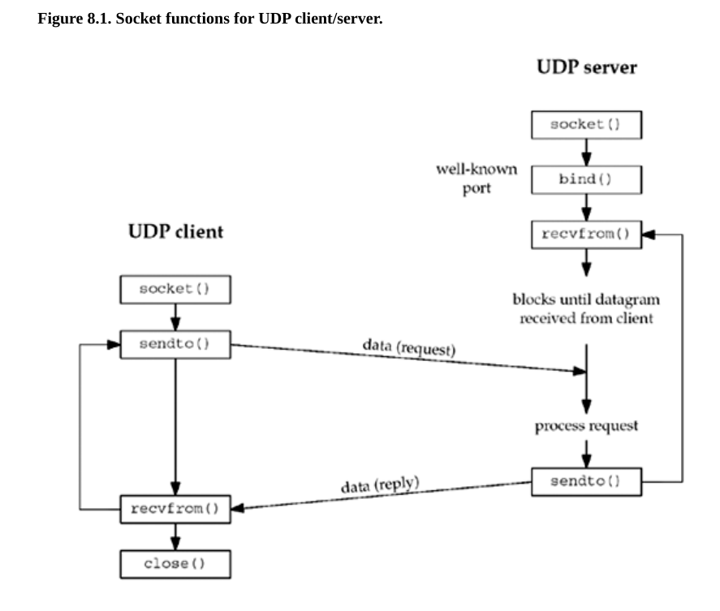

# zad 4 

--- 

* `gniazdo datagramowe` - gniazdo które pozwala na bezpołączneniowe przeyslanie pakietów bez gwarancji ich dostarczenia ani zachowania kolejności 

--- 



diagram do tcp jest prostszy, bo nie ma fazy nawiazywania polączenia 

1. przygotowanie serwera 
* socket() serwer tworzy nowy socket typu datagramowego 
* bind() serwer przypisuje gniazduznany port 
* recvfrom() serwer wywołuja tą funkcje i usypia się aż nie nadajcie datagram od klienta

2. przygotowanei klienta 
* socket() - klient tworzy nowe gniazdo datagramowe
* sendto() - klient do razu wysyła dane bez connect 

3. wymiana danych 
* klient robi sendto()
* serwer który czekał w recvfrom budzi się jak dostaje dane
* serwer przetwarza dane i wysyała odpowiedz do klienta 
* klient odbiera dane z uzyciem recvfrom() 

--- 

### czemu w przeciwieństwie do TCP, serwer może rozpocząć pracę zaraz po wykonaniu funkcji bid(2)

Bo UDP jest protokołem bezpolączeniowym. serwer nie musi tworzyć dedykowanego gniazda dla każdego klienta

### z jakiej przyczyny interface read(2) i write(2) po stronie serwera moze być niewystarczający 
* read nie identyfikuje nadawcy, read zwraca same dane. Serwer musi wiedzieć od kogo przychodzi pakiet by wiedzeć komu odpowiedzieć 
* write nie ma możliwości wskazania adresata, wysyła dane do gniazda i tyle. ale nie mówi gdzie odesłać z powrotem dane

### przedstaw semantykę operacji recvfrom(2) i sendto(2) 

``` c
       ssize_t recvfrom(size_t size,
                        int sockfd, 
                        void buf[restrict size], 
                        int flags,
                        struct sockaddr *_Nullable restrict src_addr,
                        socklen_t *_Nullable restrict addrlen
        );
```

* sockft - fd socketu 
* buf - miejsce na dane
* size - maksymalny rozmiar bajtów do odzytania
* flags - flagi które prezkazujemy 
* src_addr - adres nadawcy 
* addrlen - rozmiar struktury sockaddr

zwraacna jest liczba odczytanych bajtów lub -1 w przypadku blędu (0 to nie koniec połączenia a pusty datagram)

``` c
       ssize_t sendto(size_t size;
                    int sockfd,
                    const void buf[size],
                    int flags,
                    const struct sockaddr *dest_addr,
                    socklen_t addrlen
        );
```

* sockft - fd socketu 
* buf - miejsce na dane
* size - maksymalny rozmiar bajtów do odzytania
* flags - flagi które prezkazujemy 
* dest_addr - adres odbiorcy 
* addrlen - rozmiar struktury sockaddr

zwracana jest liczba wysłanych bajtóœ lub -1 w przypadku blędu 

### kiedy po stronie klienta następuje zwiazanie gnaizda UDP z adresem lokalnym 

* przy pierwszym wywołaniu funkcji sendto() jadro systemu automatyzcie przydziela port ulotny

### efekt jaki przynosic wykonanie connect(2) na gnieździe klienta

* komunikacja bez uścisku dłomi - UDP w przediwieństwie do TCP nie wykonuje uścisku dłoni, tylko sprawdza czy jest jakiś bląd a jeśli go nie ma to zapisuje adres ip i nuer portu aplikacji
* zmiana sposobu wysyłania danych - teraz nie podajemy adresu docelowego przy każdej operacji. zamiast sendto -> write lub send
* filtracja pakietów - gniazdo odbiera tyko tatagramy od adresu określonego w connect 
* wzrost wydajnosci - przy wysyłaniu wielu dataramów do tej samej aplikacji eliminujemy koniecznosć tymczasowego łądzenia i rozłączenia gniazda przez jądro przy kadym wywołaniu sendto

### jakie ograniczenia poprzednio wymienionych funkcji zostały poprawione przez wywołania recvmsg(2) i sendmsg(2)

rozwiazują:
* brak argument flag: read i write nei posiadaja argumentu flag który pozwala sterować opcjami przesyłania danych 
* brak dostępu do adresu docelowego