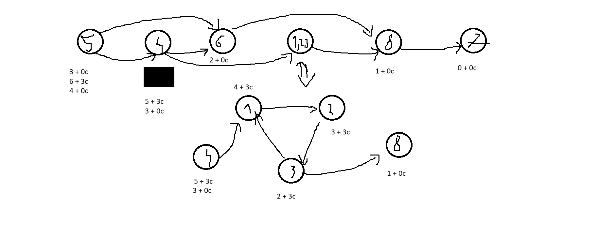

# zad10
---
### a)  w każdej turze każdy z uczestników musi wykonać ruch w grafie

* trzy pierwsze punkty z (b) tak samo

* potem liczymy odległość do ostatniego wierzchołka przyjmując że idziemy po wierzchołkach o tym samym kolorze odleglosć jest w formie (odl, odl cykliczna)

* na sam koniec sprawdzy dla wierzchołków na których stoją osoby, czy dal każdej osoby można dobrać odpowiedno dla niej czas w którym ma dojść do miejsca końcowego

### b) można robić stopy

* najpierw robimy SSS (silnie spójne składowe (przeszukiwanie w głąb na grafie transponowanym w kolejności postorder))

* SSS zwraca nam już graf posoftowany topologicznie

* idziemy dfs na koniec grafu
    * kolorujemy graf od tyłu i spamiętujemy czy w następnikach jest jakaś osoba 
    1. jeśli synowie są już pokolorowanie i maja ten sam kolor to wierzchołek dostaje ten sam kolor i spamiętuje czy któryś z potomków ma w sobie osobę
    2. synowie są już pokolorowani ale mają inne kolory
        1. jeśli tylko jeden z nich ma inforamcje o tym że ma jako potomka wierzchołek w którym jest osoba: OK, wierzchołek kolorujemy na taki sam kolor jak syn który ma w sobie drogę do osoby
        2. jeśli 2 wierzchołki mają w sobie informacje o osobie to jest: źle nie da sie doprowadzic do spotakania

* wszyscy goście idą jenym kolorem do ostatniego wierzchołka i się spotykają