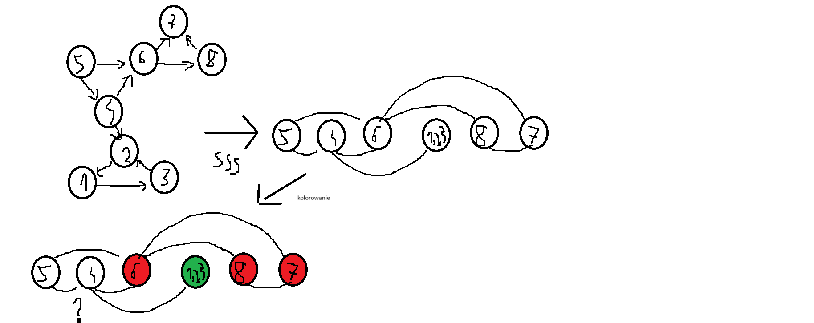

# zad10
---
### a)  w każdej turze każdy z uczestników musi wykonać ruch w grafie

* trzy pierwsze punkty z (b) tak samo

* redukujemy graf SSS do grafu pokolorowanego na ten sam kolor i krawędzi które prowadzą do wierzchołków o tym samym odpowiednim kolorze

* robimy ucs
    * stan: położenie każdej z osób na grafie
    * zbiró akcji: przemieszczenie sie każdej osoby pomiędzy wierzchołkami w tym samym momencie
    * model przejścia: sprawdzam dla każdej osoby jakie może zrobić akcje (dla każdego przejścia może być ogromna ilość akcji)
    ```
    iloczyn (dla i 1 do k) (ilość akcji dla osoby i)
    ```

    * test końcowy: jeśli pewna ilość osób jest na końcu (choćby jedna), ale ilość != k
    * funkcja kosztu: przebyta droga


### b) można robić stopy


* najpierw robimy SSS (silnie spójne składowe (przeszukiwanie w głąb na grafie transponowanym w kolejności postorder))

* SSS zwraca nam już graf posoftowany topologicznie

* idziemy dfs na koniec grafu
    * kolorujemy graf od tyłu i spamiętujemy czy w następnikach jest jakaś osoba 
    1. jeśli synowie są już pokolorowanie i maja ten sam kolor to wierzchołek dostaje ten sam kolor i spamiętuje czy któryś z potomków ma w sobie osobę
    2. synowie są już pokolorowani ale mają inne kolory
        1. jeśli tylko jeden z nich ma inforamcje o tym że ma jako potomka wierzchołek w którym jest osoba: OK, wierzchołek kolorujemy na taki sam kolor jak syn który ma w sobie drogę do osoby
        2. jeśli 2 wierzchołki mają w sobie informacje o osobie to jest: źle nie da sie doprowadzic do spotakania

* wszyscy goście idą jenym kolorem do ostatniego wierzchołka i się spotykają