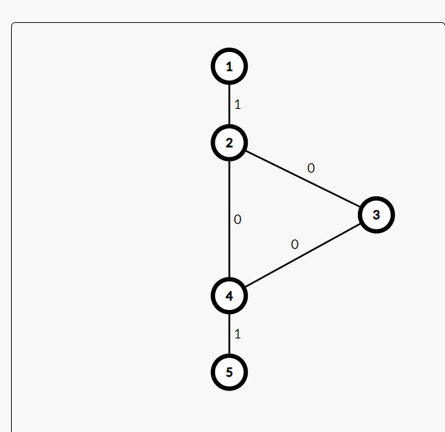
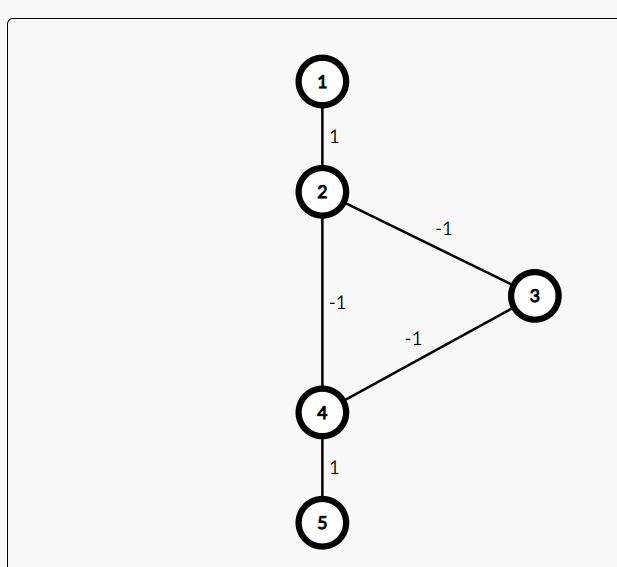

# zad6 Kiedy UCS nie działa?  
---

Ucs nie jest w stanie naleźć ścieżki w grafie (Jeśli taka ścieżka istnieje) w trzech przypadkach:
- zerowe cykle 
- negatywne cykle
- graf jest nieskończony (czasem)

Jeśli w grafie istnieją zerowe cykle to jeśli UCS wejdzie do niego to możlliwe że nigdy z niego nie wyjdzie, więc nie znajdzie też ścieżki

Jeli w grafie istnieje negatywny cykl to jeśli UCS wejdzie do niego to nie będzie się zawsze kręcił w kółko

W niektórych nieskończonych grafach ucs nie znajdzie ścieżki, np dla grafu gdzie wierzchołki są ponumerowane liczbami natualnymi, wierzchołki n i n+1 są połączone a koszt przejścia pomiędzy n i n+1 wynosi 0, a dla wierzchołków 1 i 0 koszt przejścia między nimi to 1, gdzy zaczynamy w 1 i mamy iść do wierzchołka 0 to ucs nie znajdzie drogi 

